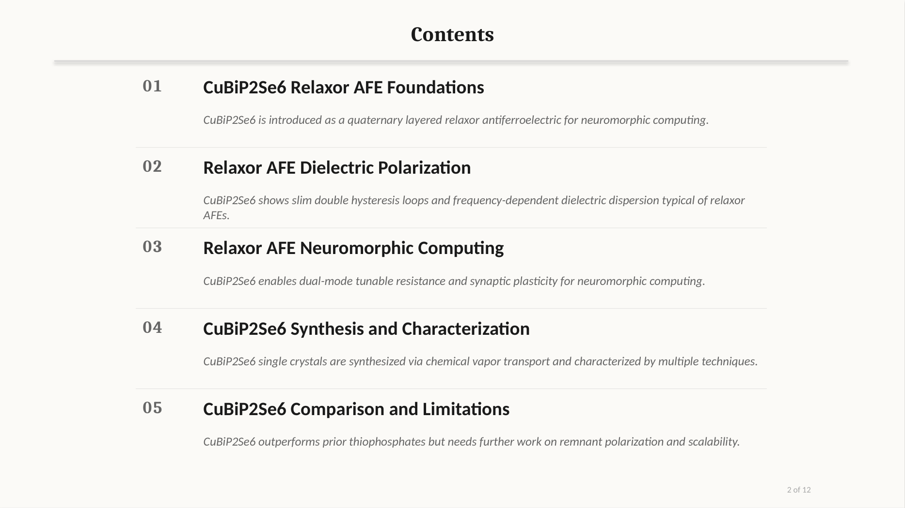
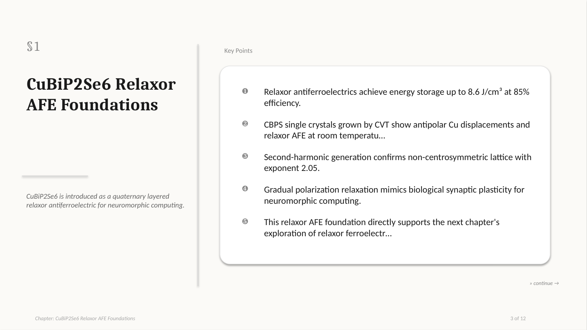

<h1 align="center">lazy-paper</h1>

<p align="center">
  <em>Turn a PDF research paper into a structured, multi-format deep analysis — in one command.</em>
</p>

<p align="center">
  <a href="https://www.python.org/downloads/"></a>
  <a href="LICENSE"></a>
  <a href="CHANGELOG.md"></a>
  <a href="#tests"></a>
  <a href="docs/AGENT_GUIDE.md"></a>
</p>

<p align="center"><strong><a href="README.md">English</a> · <a href="README.zh.md">简体中文</a></strong></p>

<p align="center">
  
  <br>
  <em>One PDF · 9 deterministic+LLM stages · four polished outputs.</em>
</p>

---

## What it does

Feed a scientific PDF + a `.docx` section-outline template. Get back **DOCX · PDF · HTML · PPTX** — bilingual deep-analysis documents with figures, tables, and quantitative anchors preserved.

```
PDF  +  outline.docx                    ┌─▶ preview.docx
        │                               │
        ▼                               │
  OCR ▶ clean ▶ chapter ▶ figures ▶ ────┼─▶ preview.pdf
  template ▶ context ▶ figure-LLM ▶ ────┼─▶ preview.html
  section-LLM ▶ render ────────────────┼─▶ preview.pptx
                                        │   (academic-defense style)
                                        ▼
                                  runs/<paper-id>/s09_render/
```

Each stage writes `done.yaml` and is independently re-runnable; every LLM call persists its prompt and response for audit.

## Quickstart

```bash
# Install
curl -LsSf https://astral.sh/uv/install.sh | sh
git clone https://github.com/thematteroftime/lazy-paper && cd lazy-paper
uv python install 3.11 && uv venv --python 3.11
uv pip install -e ".[dev]"
brew install pango gdk-pixbuf libffi cairo   # macOS only (WeasyPrint)

# Configure
cp .env.example .env   # then fill MINERU_TOKEN + LLM_*_API_KEY

# Run
uv run python -m cli run \
  --pdf "papers/your-paper.pdf" \
  --template "Table of Contents-Relaxor AFE-ZGY-HW.docx" \
  --paper-id mypaper --lang zh --formats docx,pdf,html,pptx
```

Output lands at `runs/<paper-id>/s09_render/preview.{docx,pdf,html,pptx}`.

> **Windows users**: prefer the Docker path (`docker compose build && docker compose run --rm lazy-paper run …`) — WeasyPrint needs the GTK runtime which Docker bundles.

## Output formats

<table>
  <tr>
    <th width="80">Format</th>
    <th>What you get</th>
  </tr>
  <tr>
    <td><code>docx</code></td>
    <td>Self-contained Word file; Times New Roman + Song Ti for Chinese</td>
  </tr>
  <tr>
    <td><code>pdf</code></td>
    <td>Same content rendered through WeasyPrint from a shared HTML template</td>
  </tr>
  <tr>
    <td><code>html</code></td>
    <td>Single file with base64-embedded images — emailable, viewable anywhere</td>
  </tr>
  <tr>
    <td><code>pptx</code></td>
    <td>Academic-defense styled: cream/charcoal palette, LLM-grouped 4–5 section outline, side-by-side bullets+figure slides, rich closing with quantitative take-away</td>
  </tr>
</table>

<p align="center">
  
  <br>
  <em>A section-divider slide. Density-adaptive font + autofit safety net keeps long bullets readable.</em>
</p>

## Tech stack

<p>
  
  
  
  
  
  
  
</p>

| Layer | Library / service | Purpose |
|---|---|---|
| Runtime | **Python 3.11+** | uv-managed virtualenv recommended |
| PDF I/O | `pdfplumber`, `pypdfium2`, `Pillow` | text extraction, rasterization, image processing |
| OCR | [MinerU](https://mineru.net/) · [PaddleOCR-VL](https://ai.baidu.com/ai-doc/AISTUDIO) | cloud OCR (figure-aware) |
| LLM client | `openai>=1.50` | OpenAI-compatible — one config, any provider |
| Default text LLM | [DeepSeek-Reasoner](https://api-docs.deepseek.com/) | chain-of-thought analysis quality |
| Default vision LLM | [Qwen-VL-Max](https://help.aliyun.com/zh/dashscope/) | figure understanding |
| Templates | `python-docx`, `jinja2` | parse outline `.docx`, render HTML |
| Renderers | `python-docx`, `python-pptx`, `weasyprint`, `jinja2` | one stateless renderer per format |
| Config | `pyyaml`, `python-dotenv` | YAML artifacts + `.env` credentials |
| HTTP | `requests` | OCR API calls |
| Dev | `pytest>=8` | 189 tests |

## Quality controls (v1.3)

- **Quantitative validation**: every PPT chapter bullet must carry ≥1 numeric anchor; closing-slide takes ≥3 quantitative bullets + a comparative takeaway. Enforced post-LLM via regex; non-conforming responses trigger retry.
- **Critique-vs-description**: figure observations rejected when all-descriptive ("shows / depicts") with no critique markers ("limitation / missing / should").
- **Layout robustness**: outline rows are dynamically sized to wrap-count; KEY POINTS bullet font + length scale with density (16pt ↔ 13pt); figure observation height shrinks rather than overflows.
- **Single env knob to cap LLM cost**: `LLM_MAX_TOKENS_CEILING` (default 40000) clamps every call site.

## CLI reference

```
lazy-paper run --pdf PATH --template PATH [options]

Options
  --paper-id ID             run-directory slug (default: derived from PDF stem)
  --runs-dir PATH           artifact root (default: ./runs)
  --lang {zh,en}            output language (default: zh)
  --skip-ocr                assume s01_ocr already exists
  --force                   re-run stages even if marked done
  --only STAGE[,STAGE...]   subset of STAGE_ORDER (comma-separated)
  --formats LIST            docx,pdf,html,pptx (default: docx,pdf,html)
  --pptx-bullets {llm,rule} bullet strategy (default: llm)
  --pptx-template PATH      custom .pptx slide-master
  --pptx-subtitle TEXT      override the PPT subtitle line
  --presenter TEXT          PPT title-slide speaker
  --affiliation TEXT        PPT title-slide institution
  --retry-failed            with --only s09_render, re-run only formats marked partial
```

## Switching providers

`lazy-paper` works with any OpenAI-compatible vision and text endpoint. Edit `LLM_*_BASE_URL`, `LLM_*_API_KEY`, `LLM_*_MODEL` in `.env`. Tested with Qwen-VL (DashScope) and DeepSeek-Reasoner. Works with OpenAI, Anthropic-compatible gateways, self-hosted vLLM/Ollama.

For OCR: `OCR_BACKEND=mineru` (recommended for figure-heavy papers) or `OCR_BACKEND=paddleocr`.

## Tests

```bash
uv run pytest -q          # 189 tests
uv run pytest -m live     # live LLM smoke tests (real keys)
```

## Citation

```bibtex
@software{lazy_paper,
  author  = {thematteroftime},
  title   = {lazy-paper: PDF research papers to multi-format deep analysis},
  url     = {https://github.com/thematteroftime/lazy-paper},
  version = {1.3.0},
  year    = {2026}
}
```

## Acknowledgements

[MinerU](https://github.com/opendatalab/MinerU) · [PaddleOCR](https://github.com/PaddlePaddle/PaddleOCR) · [DeepSeek](https://www.deepseek.com/) · [Qwen](https://github.com/QwenLM/Qwen) · [WeasyPrint](https://github.com/Kozea/WeasyPrint) · [python-pptx](https://github.com/scanny/python-pptx) · [python-docx](https://github.com/python-openxml/python-docx)

## Documentation

| File | Audience |
|---|---|
| [`README.md`](README.md) · [`README.zh.md`](README.zh.md) | First-time user (EN / ZH) |
| [`docs/ARCHITECTURE.md`](docs/ARCHITECTURE.md) | Maintainer — per-stage contracts |
| [`docs/AGENT_GUIDE.md`](docs/AGENT_GUIDE.md) | AI coding agent — workflow + anti-patterns |
| [`docs/INTERNAL/HANDOFF.md`](docs/INTERNAL/HANDOFF.md) | Next maintainer — verified state + change-locations |
| [`CHANGELOG.md`](CHANGELOG.md) | Release-by-release diff |
| [`CONTRIBUTING.md`](CONTRIBUTING.md) | External contributor norms |

## License

MIT — see [`LICENSE`](LICENSE).
