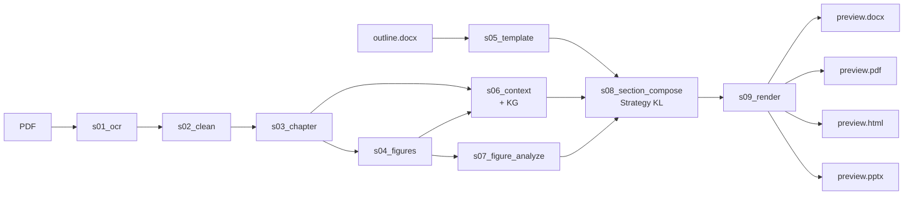
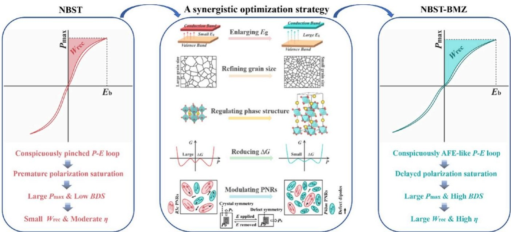
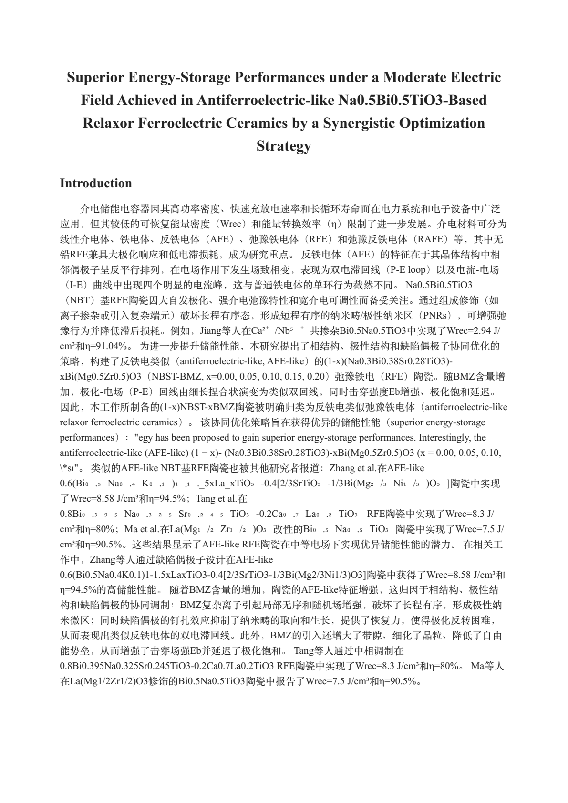
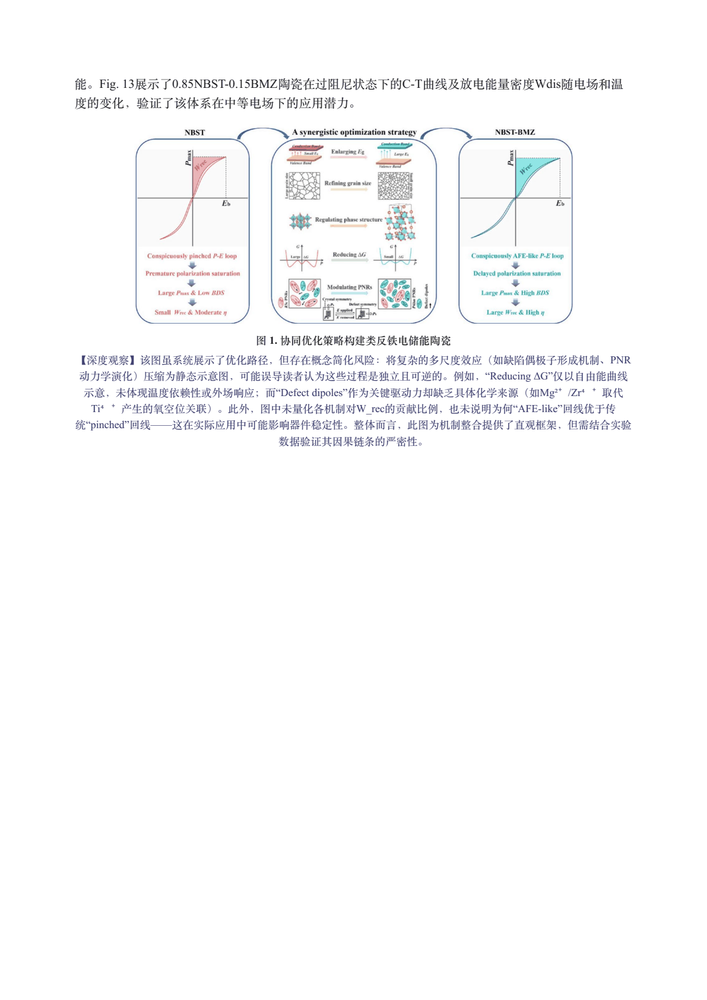

<h1 align="center">lazy-paper</h1>

<p align="center">
  <em>Turn a PDF research paper into a structured, multi-format deep analysis — in one command.</em>
</p>

<p align="center">
  <a href="https://www.python.org/downloads/"></a>
  <a href="LICENSE"></a>
  <a href="CHANGELOG.md"></a>
  <a href="#tests"></a>
  <a href="docs/AGENT_GUIDE.md"></a>
</p>

<p align="center"><strong><a href="README.md">English</a> · <a href="README.zh.md">简体中文</a></strong></p>

<p align="center">
  
  <br>
  <em>One PDF · 9 deterministic+LLM stages · four polished outputs.</em>
</p>

---

## What it does

Feed a scientific PDF + a `.docx` section-outline template. Get back **DOCX · PDF · HTML · PPTX** — bilingual deep-analysis documents with figures, tables, and quantitative anchors preserved.

```
                                                  ┌──▶ preview.docx
PDF  +  outline.docx                              │
       │                                          ├──▶ preview.pdf
       ▼                                          │
  s01_ocr  ▶  s02_clean  ▶  s03_chapter ┐         ├──▶ preview.html
                                        │         │
  s04_figures ─────────┐                ├─▶ s09 ──┴──▶ preview.pptx
                       ├─▶ s06_context ─┤
  s05_template ────────┤    (+ KG)      │
                       │                │
  s07_figure_analyze ──┴─▶ s08_section_compose
                              (Strategy KL: retriever + verifier + retry)
```



Each stage writes `done.yaml` and is independently re-runnable; every LLM call persists its prompt and response for audit.

## Real-Data Pipeline Walkthrough

The diagram above shows the shape. The walkthrough below shows the substance — every snippet is a verbatim slice from `runs/meng2024_v111_demo/` (an ACS Appl. Mater. Interfaces 2024 NBT-based RFE paper). Read it once and you'll know exactly what happens to your PDF.

### s01 → s02 — OCR, then normalize

**Input** `papers/meng2024.pdf` (16-page PDF, figures embedded). MinerU returns markdown per page; lazy-paper concatenates into `s01_ocr/doc_*.md`.

```text
runs/meng2024_v111_demo/s01_ocr/doc_5.md
... $$$$
where $\varepsilon_{r(T)}$ is the $\varepsilon_r$ at various temperatures ...
```

**What this stage does.** s02 strips OCR artifacts (empty `$$$$` formulas, mis-flowed columns) into a comment, leaves text intact.

```text
runs/meng2024_v111_demo/s02_clean/doc_5.md
... <!-- corrupted-column-flow -->
where $\varepsilon_{r(T)}$ is the $\varepsilon_r$ at various temperatures ...
```

**Decision point.** Empty math blocks downstream cause LaTeX errors in DOCX/PDF rendering, so we mark them instead of dropping silently — a human reviewing the clean markdown can still see where data went missing.

### s03 — Chapter assembly

**Input** all `s02_clean/doc_*.md`. Lazy-paper detects `# 1. INTRODUCTION`, `## 2. EXPERIMENTAL SECTION` style headings and groups continuous pages into chapter files.

**Output**

```yaml
# runs/meng2024_v111_demo/s03_chapter/chapter_index.yaml
- chapter_no: 1
  title: INTRODUCTION
  file: chapter_001_INTRODUCTION.md
  sources: [doc_0.md, doc_1.md, doc_10.md, doc_11.md]
  chars: 14929
- chapter_no: 5
  title: RESULTS AND DISCUSSION
  file: chapter_005_RESULTS_AND_DISCUSSION.md
  sources: [doc_2.md, doc_3.md, doc_5.md, doc_6.md, doc_7.md, doc_8.md, doc_9.md]
  chars: 22129
```

**Decision point.** Source pages are tracked per chapter so retrieval (s06/s08) can scope candidates to the correct chunks instead of searching the whole paper.

### s04 — Figures, mentions, tables

Three artefacts, each load-bearing later:

```yaml
# s04_figures/figures.yaml — entry for Fig. 1
- fig_id: Fig. 1
  image_rel_path: imgs/img_mineru_005.jpg
  caption: Schematic diagram of the synergistic optimization strategy ...
  source_doc: doc_1.md

# s04_figures/mentions.yaml — chapter ↔ figure cross-index
chapter_005_RESULTS_AND_DISCUSSION.md:
  - Fig. 2a
  - Fig. 11
  - Fig. 12
  - Fig. 13
  ...
```

**Decision point — caption-stub filter (v1.11.1).** Some OCR splits assign meaningless captions like `(a)` or `A high quality photo of a dog playing in a green field` to figure entries. From v1.11.1, captions failing the stub-detector are dropped before s07 vision LLM ever sees them. On the cross-domain unCLIP paper (`runs/hif_2_v111_demo/`) this filter removed 2 of 46 figure entries — `Fig. 43`'s two prompt-stub captions — that v1.10 would have wasted vision-LLM calls on.

<p align="center">
  
  <br>
  <em>Real artefact from <code>s04_figures/</code>: Fig. 1 of the meng2024 NBT paper, cropped by MinerU and inventoried in <code>figures.yaml</code>. This exact image flows into s07 (vision LLM) and s09 (renderers).</em>
</p>

### s05 — Outline template

**Input** the `Table of Contents-Relaxor AFE-ZGY-HW.docx` outline (your domain guidance). lazy-paper parses it into a tree of section titles with `{paper.system}`, `{paper.figures}`, `{paper.key_terms}` Jinja-style slots.

```yaml
# s05_template/template.yaml
- level: 1
  title: Introduction
  guidance: |
    (Research background and motivation: {paper.system})
    Antiferroelectrics
    Describe the fundamental characteristics of antiferroelectrics (AFE): crystal
    structure, P-E hysteresis loop, phase transition behavior ...
    Identify which AFE category {paper.system} belongs to. Draw on key terms
    {paper.keywords}.
  hints: {needs_table: false, needs_figure: false}
```

**Decision point.** The template is the user-supplied "what should this section say"; the slots resolve against `s06/context.yaml` so the same template works on any paper in the field.

### s06 — Context + 11-type KG

**Input** the title, abstract, and intro chapter from s03. **Output** a structured paper facts-sheet and a small typed knowledge graph.

```yaml
# s06_context/context.yaml (v1.11.1+)
title: Superior Energy-Storage Performances ... AFE-like Na0.5Bi0.5TiO3-Based RFE ...
system: (1-x)(Na0.3Bi0.38Sr0.28TiO3)-xBi(Mg0.5Zr0.5)O3 (x = 0.00 ... 0.20) ceramics
abbreviations:
  - {abbr: NBST, expansion: Na0.3Bi0.38Sr0.28TiO3}
  - {abbr: BMZ,  expansion: Bi(Mg0.5Zr0.5)O3}
  - {abbr: W_rec, expansion: recoverable energy density}
key_terms: [antiferroelectric-like, relaxor ferroelectric, defect dipole, ...]
headline_metrics:                              # ← v1.11.1 fix
  flagship: 0.85(Na0.3Bi0.38Sr0.28TiO3)-0.15Bi(Mg0.5Zr0.5)O3
  W_rec: '5.00'
  η: '90.09'
```

```text
# s06_context/paper_kg.parquet — 35 entities, 24 relations
material  m_85NBST15BMZ   0.85(Na0.3Bi0.38Sr0.28TiO3)-0.15Bi(Mg0.5Zr0.5)O3
dopant    d_BMZ           Bi(Mg0.5Zr0.5)O3
parameter p_Wrec          W_rec
value     v_main_Wrec     5.00
unit      u_Jcm3          J/cm³
# rel: m_85NBST15BMZ —[has_W_rec]→ v_main_Wrec
```

**Decision point — headline_metrics (v1.11.1 fix).** Before v1.11.1 the abstract-mining step dropped `flagship / W_rec / η` when the prompt was too long. The s06 prompt now keeps this block; the v1.10 demo's `context.yaml` ends at `critical_questions:`, the v1.11.1 demo extends with `headline_metrics:` and the figures referencing those numbers are pinned through s08.

### s07 — Vision LLM on every figure

**Input** for each figure, the cropped image + its caption + nearby text. The vision LLM (Qwen-VL-Max by default) returns: visual summary, per-claim verdict against the surrounding text, and a critical "deep observation".

```yaml
# s07_figure_analyze/fig_notes.yaml — Fig. 1 entry (compressed)
- fig_id: Fig. 1
  visual_summary: 图像展示了从NBST到NBST-BMZ陶瓷的协同优化策略示意图 ...
  text_claim_check:
    - claim: BMZ complex ions lead to local disorder, increasing random field ...
      verdict: supported
      note: 图中"Regulating phase structure"用不同颜色和形状表示局域无序 ...
    - claim: Defect dipoles inhibit orientation and growth of PNRs ...
      verdict: supported
      note: 右侧PNR图中明确画出"Defect dipoles"并标注其对PNR的钉扎作用 ...
  deep_observation: |
    存在潜在逻辑跳跃：例如，"Refining grain size"与"Reducing ΔG"之间缺乏直接因果链 ...
    未体现BMZ掺杂如何具体诱导缺陷偶极子形成，这可能是机制链条中的隐含假设。
```

**Decision point — critique vs description.** The `deep_observation` is later passed through a "critique-vs-description" gate: if it contains only descriptive verbs (`shows / depicts`) without critique markers (`limitation / missing / should`), the figure block is rejected and the vision LLM is retried with a sharpened prompt.

### s08 — Section composer (Strategy KL)

**Input** template node (s05) + context+KG (s06) + figure notes (s07) + chapter chunks (s03). For each section:

1. **Retriever** — RRF over dense embedding + BM25, KG-entity-overlap boost, picks top-k chunks.
2. **Composer LLM** — writes a structured response (`claims[]`), each claim citing chunk IDs + figure IDs + an inline quote.
3. **Verifier** — re-checks every `cited_quote` against the source chunk after LaTeX/OCR normalization; drops hallucinated citations.
4. **Retry-when-empty** — if verified coverage falls below threshold, one strengthened retry fires.

```json
// s08_section_compose/01-Introduction.structured.json (one claim)
{
  "text": "反铁电体（AFE）的特征在于其晶体结构中相邻偶极子呈反平行排列，在电场作用下发生场致相变，表现为双电滞回线（P-E loop）以及电流-电场（I-E）曲线中出现四个明显的电流峰 ...",
  "cited_chunk_ids": [2],
  "cited_quote": "the evolution of P−E loops from a slim and pinched shape to a double-like one but also the I−E curves with four distinct current peaks observed in AFE ceramics",
  "figure_ids": []
}
```

**Decision point — figure_ids hard constraint (v1.10 Variant C).** A claim that references a figure must list its `fig_id` here. The render stage refuses to insert an image whose id is not in `figure_ids` of some claim, eliminating one whole class of hallucination ("Fig. 7 shows X" when the chapter never mentioned Fig. 7).

### s09 — Render to DOCX · PDF · HTML · PPTX

The structured claims flow into a Jinja HTML template; WeasyPrint converts to PDF; python-docx/pptx walk the same intermediate tree for the office formats.

```html
<!-- runs/meng2024_v111_demo/s09_render/preview.html — one rendered paragraph -->
<p class="body-paragraph">
  仍需解决的开放问题包括：缺陷偶极子的原子尺度构型 ... 0.85NBST-0.15BMZ
  虽在340 kV/cm下实现了优异的储能性能，包括高可恢复储能密度和高效率
  （Fig. 11d–e），但该Eb（~340 kV/cm）仍属中等水平 ...
</p>
```

**Decision point — citation markers by mode.** `[span:...]` markers are stripped by default for clean prose; pass `--debug-citations` to surface them for attribution audit.

<p align="center">
  
  
  <br>
  <em>Real pages from <code>runs/meng2024_v111_demo/s09_render/preview.pdf</code> — left: title + composed introduction; right: extracted Fig. 1 inline with its caption and the s07 deep-observation critique that survived the figure_ids hard constraint.</em>
</p>

### Template selection is the single most load-bearing choice — read this first

**The template's section headings are inserted verbatim into the s08 compose prompt.** If you hand "Dielectric Properties of Relaxor AFE" to an unCLIP image-generation paper, one of two things happens: the LLM writes an out-of-scope disclaimer (Phase-4 prompt-tailor OFF) or — worse — it stuffs unCLIP content under the wrong section and the output reads unfaithful. Same paper, same model, same prompt — a wrong template can swing RAGAS faithfulness from 0.81 down to 0.10.

| Template (`templates/<file>`) | Best for |
|---|---|
| `Table of Contents-CV-IMRaD.docx` | Generic CV / ML / IMRaD-style papers (Introduction → Method → Experiments → Results → Discussion) |
| `Table of Contents-Relaxor AFE-ZGY-HW.docx` | Materials science (ferroelectrics, energy storage, related families) |
| `Table of Contents-ATEC-B2w-Reward-ZGY.docx` | Reinforcement-learning reward design for legged / wheeled-legged robots (ATEC2026 B2w energy-regularization variant) |
| `Table of Contents-ATEC-B2w-MUJICA-v2-ZGY.docx` | Multi-skill unified RL frameworks (energy + skill selector + DC-motor constraints, ATEC2026 B2w + Piper) |

Empirical evidence (RAGAS faithfulness on the unCLIP paper, 10 golden Q/A):

| Template | Phase 4 prompt tailoring | faithfulness |
|---|---|---|
| Relaxor AFE (wrong domain) | OFF | 0.353 |
| Relaxor AFE (wrong domain) | ON | **0.100** (regression) |
| CV-IMRaD (correct domain) | ON | **0.810** |

Treat template selection as a first-class input, not a default. The four shipped examples cover most use cases; for a new domain copy the closest match and edit the section headings. There is no "good enough generic template" — the wrong one quietly degrades every downstream stage.

## Quickstart

```bash
# Install
curl -LsSf https://astral.sh/uv/install.sh | sh
git clone https://github.com/thematteroftime/lazy-paper && cd lazy-paper
uv python install 3.11 && uv venv --python 3.11
uv pip install -e ".[dev]"
brew install pango gdk-pixbuf libffi cairo   # macOS only (WeasyPrint)

# Configure
cp .env.example .env   # then fill the tokens — see "Get the API keys" below

# Run — pick the template that matches your paper's domain (read above first)
uv run python -m cli run \
  --pdf "papers/your-paper.pdf" \
  --template "templates/Table of Contents-CV-IMRaD.docx" \
  --paper-id mypaper --lang zh --formats docx,pdf,html,pptx
```

Output lands at `runs/<paper-id>/s09_render/preview.{docx,pdf,html,pptx}`. The four shipped templates live in [`templates/`](templates/).

### Get the API keys

lazy-paper composes its outputs from three cloud roles. Sign up once, paste the key into `.env`, you're done.

| Role | Recommended provider | Sign-up link | `.env` key |
|---|---|---|---|
| **OCR** (default) | MinerU cloud | <https://mineru.net> → account → API tokens | `MINERU_TOKEN` |
| **OCR** (alt) | PaddleOCR-VL via Baidu AI Studio | <https://aistudio.baidu.com/paddleocr> | `PADDLEOCR_TOKEN` |
| **Text LLM** (recommended) | DeepSeek-Reasoner | <https://platform.deepseek.com> → API keys | `LLM_TEXT_API_KEY` |
| **Vision LLM** (recommended) | Qwen-VL on Aliyun DashScope / Bailian | <https://bailian.console.aliyun.com/> → API keys | `LLM_VISION_API_KEY` |

All four are OpenAI-compatible — to use a different provider (OpenAI, Anthropic-compatible gateway, self-hosted vLLM, Ollama), point `LLM_*_BASE_URL` + `LLM_*_MODEL` at it. Detailed walkthrough in [`docs/USER_GUIDE.md`](docs/USER_GUIDE.md).

> **Windows users**: prefer the Docker path (`docker compose build && docker compose run --rm lazy-paper run …`) — WeasyPrint needs the GTK runtime which Docker bundles.

## Output formats

<table>
  <tr>
    <th width="80">Format</th>
    <th>What you get</th>
  </tr>
  <tr>
    <td><code>docx</code></td>
    <td>Self-contained Word file; Times New Roman + Song Ti for Chinese; v1.13 picks up the shared design tokens (accent <code>#D97757</code> chapter numbers + left border, secondary-gray captions, italic accent-bordered deep-observation aside)</td>
  </tr>
  <tr>
    <td><code>pdf</code></td>
    <td>WeasyPrint renders the HTML output; the print CSS suppresses topbar / TOC / controls and keeps formulas as italic serif inline (Unicode fallback)</td>
  </tr>
  <tr>
    <td><code>html</code></td>
    <td>Single file with base64-embedded images. v1.13 adds a sticky topbar, right-rail TOC with scroll highlight, three accent themes, copy-on-click LaTeX, and KaTeX math rendering. Default links the jsdelivr CDN; set <code>LAZY_PAPER_INLINE_KATEX=1</code> for a fully offline single file (~1.08 MB).</td>
  </tr>
  <tr>
    <td><code>pptx</code></td>
    <td>Academic-defense styled: cream/charcoal palette, LLM-grouped 4–5 section outline, side-by-side bullets+figure slides, rich closing with quantitative take-away</td>
  </tr>
</table>

<p align="center">
  
  <br>
  <em>A section-divider slide. Density-adaptive font + autofit safety net keeps long bullets readable.</em>
</p>

### v1.13 sample output

<p align="center">
  
  
  
  <br>
  <em>Real pages from <code>runs/atec-b2w-energy-rl/s09_render/preview.pdf</code> — left: title + chapter 01 with accent vertical bar; middle: Fig. 2 multi-panel + accent-bordered 深度观察 aside; right: energy-regularization chapter with inline italic math (KaTeX-fallback Unicode in PDF).</em>
</p>

## Tech stack

<p>
  
  
  
  
  
  
  
</p>

| Layer | Library / service | Purpose |
|---|---|---|
| Runtime | **Python 3.11+** | uv-managed virtualenv recommended |
| PDF I/O | `pdfplumber`, `pypdfium2`, `Pillow` | text extraction, rasterization, image processing |
| OCR | [MinerU](https://mineru.net/) · [PaddleOCR-VL](https://ai.baidu.com/ai-doc/AISTUDIO) | cloud OCR (figure-aware) |
| LLM client | `openai>=1.50` | OpenAI-compatible — one config, any provider |
| Default text LLM | [DeepSeek-Reasoner](https://api-docs.deepseek.com/) | chain-of-thought analysis quality |
| Default vision LLM | [Qwen-VL-Max](https://help.aliyun.com/zh/dashscope/) | figure understanding |
| KG extraction | `instructor` | typed Pydantic LLM output; 10-type closed-schema entity/relation extraction |
| Retrieval | `llama-index-core`, `llama-index-retrievers-bm25`, `bm25s` | chunk + dense + BM25 + RRF hybrid retrieval |
| Section agent | `pydantic-ai-slim[openai]` | typed tool-calling agent for section composition (env-gated) |
| Parquet I/O | `pyarrow` | PaperDB storage (paper_kg.parquet, retrieval.parquet) |
| Templates | `python-docx`, `jinja2` | parse outline `.docx`, render HTML |
| Renderers | `python-docx`, `python-pptx`, `weasyprint`, `jinja2` | one stateless renderer per format |
| Config | `pyyaml`, `python-dotenv` | YAML artifacts + `.env` credentials |
| HTTP | `requests` | OCR API calls |
| Dev | `pytest>=8` | 321 tests |

## Quality controls

- **Quantitative validation**: every PPT chapter bullet must carry ≥1 numeric anchor; closing-slide takes ≥3 quantitative bullets + a comparative takeaway. Enforced post-LLM via regex; non-conforming responses trigger retry.
- **Critique-vs-description**: figure observations rejected when all-descriptive ("shows / depicts") with no critique markers ("limitation / missing / should").
- **Layout robustness**: outline rows are dynamically sized to wrap-count; KEY POINTS bullet font + length scale with density (16pt ↔ 13pt); figure observation height shrinks rather than overflows.
- **Closed 11-type KG**: `instructor`-driven extraction of material / dopant / parameter / value / unit / figure / table / claim / method / comparator / author entities — every extracted entity carries a `source_span` tying it back to the exact passage.
- **Hybrid retrieval (RRF + entity boost)**: dense cosine + BM25 sparse results fused via Reciprocal Rank Fusion; chunks overlapping with KG entity spans are boosted, pulling relevant passages toward top evidence.
- **Two-tier critic**: a regex critic flags numeric / figure / unit mismatches; the LLM critic only fires when regex flags appear, minimizing cost while targeting the highest-risk prose.
- **Strategy KL (opt-in, recommended for benchmark recovery)**: structured composer + per-claim verifier + retry-when-empty. The verifier re-checks each quote against the source (LaTeX/OCR normalization) and rejects hallucinated citations; one strengthened retry fires when post-verify coverage is low. See `docs/USER_GUIDE.md` for the env-var combo.
- **Citation markers rendered or stripped by mode**: `[span:...]` markers are stripped by default (clean prose); pass `--debug-citations` to expose them for attribution auditing.
- **Single env knob to cap LLM cost**: `LLM_MAX_TOKENS_CEILING` (default 40000) clamps every call site.

## CLI reference

```
lazy-paper run --pdf PATH --template PATH [options]

Options
  --paper-id ID             run-directory slug (default: derived from PDF stem)
  --runs-dir PATH           artifact root (default: ./runs)
  --lang {zh,en}            output language (default: zh)
  --skip-ocr                assume s01_ocr already exists
  --force                   re-run stages even if marked done
  --only STAGE[,STAGE...]   subset of STAGE_ORDER (comma-separated)
  --formats LIST            docx,pdf,html,pptx (default: all four)
  --pptx-bullets {llm,rule} bullet strategy (default: llm)
  --pptx-template PATH      custom .pptx slide-master
  --pptx-subtitle TEXT      override the PPT subtitle line
  --presenter TEXT          PPT title-slide speaker
  --affiliation TEXT        PPT title-slide institution
  --retry-failed            with --only s09_render, re-run only formats marked partial
```

## Switching providers

`lazy-paper` works with any OpenAI-compatible vision and text endpoint. Edit `LLM_*_BASE_URL`, `LLM_*_API_KEY`, `LLM_*_MODEL` in `.env`. Tested with Qwen-VL (DashScope) and DeepSeek-Reasoner. Works with OpenAI, Anthropic-compatible gateways, self-hosted vLLM/Ollama.

For OCR: `OCR_BACKEND=mineru` (recommended for figure-heavy papers) or `OCR_BACKEND=paddleocr`.

## Tests

```bash
uv run pytest -q          # 321 tests
uv run pytest -m live     # live LLM smoke tests (real keys)
```

## Citation

```bibtex
@software{lazy_paper,
  author  = {thematteroftime},
  title   = {lazy-paper: PDF research papers to multi-format deep analysis},
  url     = {https://github.com/thematteroftime/lazy-paper},
  version = {1.13-render},
  year    = {2026}
}
```

## Acknowledgements

[MinerU](https://github.com/opendatalab/MinerU) · [PaddleOCR](https://github.com/PaddlePaddle/PaddleOCR) · [DeepSeek](https://www.deepseek.com/) · [Qwen](https://github.com/QwenLM/Qwen) · [WeasyPrint](https://github.com/Kozea/WeasyPrint) · [python-pptx](https://github.com/scanny/python-pptx) · [python-docx](https://github.com/python-openxml/python-docx)

## Documentation

| File | Audience |
|---|---|
| [`README.md`](README.md) · [`README.zh.md`](README.zh.md) | First-time user (EN / ZH) |
| [`docs/USER_GUIDE.md`](docs/USER_GUIDE.md) | End user — setup, quickstart, iteration, troubleshooting |
| [`docs/ARCHITECTURE.md`](docs/ARCHITECTURE.md) | Maintainer — per-stage contracts |
| [`docs/AGENT_GUIDE.md`](docs/AGENT_GUIDE.md) | AI coding agent — workflow + anti-patterns |
| [`templates/`](templates/) | Four ready-to-use outline templates (CV-IMRaD, Relaxor AFE, ATEC-B2w) |
| [`docs_zh/`](docs_zh/) | Simplified-Chinese mirror of USER_GUIDE / ARCHITECTURE / AGENT_GUIDE |
| [`CHANGELOG.md`](CHANGELOG.md) | Release-by-release diff |
| [`CONTRIBUTING.md`](CONTRIBUTING.md) | External contributor norms |

## License

MIT — see [`LICENSE`](LICENSE).
