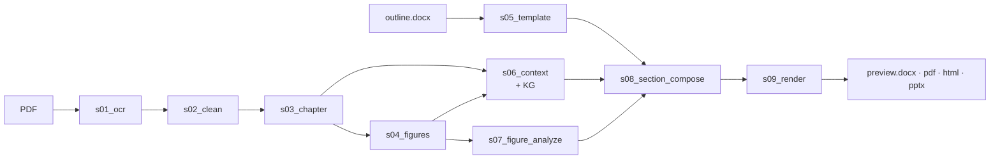
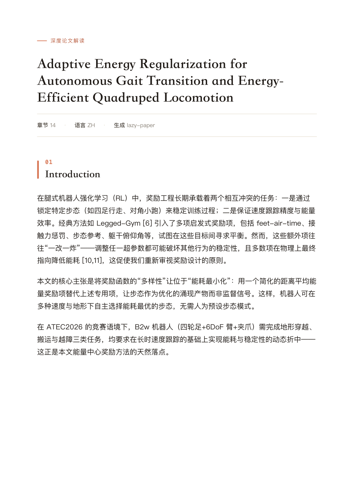
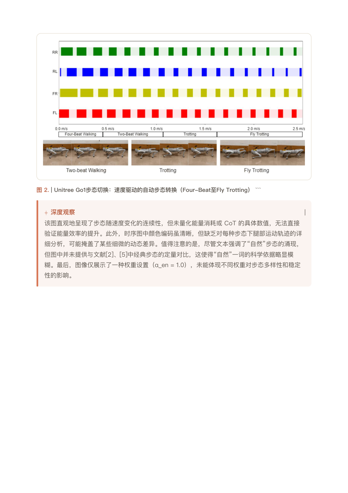
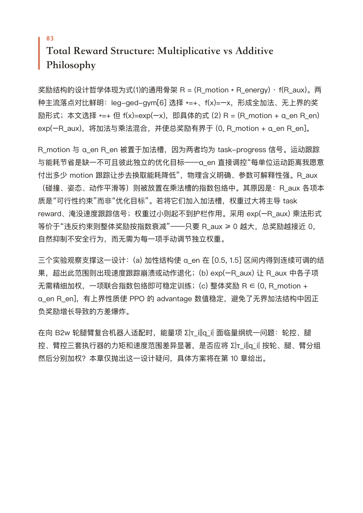

<h1 align="center">lazy-paper</h1>

<p align="center">
  <em>Turn a PDF research paper into a structured, multi-format deep analysis — in one command.</em>
</p>

<p align="center">
  <a href="https://www.python.org/downloads/"></a>
  <a href="LICENSE"></a>
  <a href="CHANGELOG.md"></a>
  <a href="docs/AGENT_GUIDE.md"></a>
</p>

<p align="center"><strong><a href="README.md">English</a> · <a href="README.zh.md">简体中文</a></strong></p>

<p align="center">
  
</p>

---

## What it does

Feed it a scientific PDF + a `.docx` section-outline template. Get back **DOCX · PDF · HTML · PPTX** — bilingual deep-analysis documents with figures, tables, and quantitative anchors preserved. One command, nine stages, every step resumable.



Each stage writes `done.yaml` and is independently re-runnable; every LLM call persists its prompt and response. Stage-by-stage walkthrough lives in [`docs/ARCHITECTURE.md`](docs/ARCHITECTURE.md).

## See what comes out

**PDF / DOCX / HTML** — design tokens shared across all three (accent `#D97757`, serif headings, accent-bordered `深度观察` aside):

<p align="center">
  
  
  
</p>

**PPTX** — academic-defense styling, density-adaptive font, LLM-grouped section divider:

<p align="center">
  
</p>

## What's new in v1.13-render

The most recent release rebuilds the rendering layer end-to-end:

- **HTML** — KaTeX math, sticky topbar, right-rail TOC, three accent themes, copy-on-click LaTeX. `LAZY_PAPER_INLINE_KATEX=1` produces a fully offline single-file (~1.08 MB).
- **DOCX** — accent palette + serif headings + accent-bordered deep-observation aside; same visual language as HTML/PDF.
- **MinerU OCR** — handles `chart`-typed scientific plots (was silently skipping them); restored 10 / 12 figures on figure-rich text-PDFs.
- **Chapter detection** — recognises Roman-numeral IEEE / conference section headings and modern RL / robotics anchors (`related work`, `evaluation`, `ablation`, …).

Full diff in [`CHANGELOG.md`](CHANGELOG.md).

## Quickstart

```bash
# Install
curl -LsSf https://astral.sh/uv/install.sh | sh
git clone https://github.com/thematteroftime/lazy-paper && cd lazy-paper
uv python install 3.11 && uv venv --python 3.11
uv pip install -e ".[dev]"
brew install pango gdk-pixbuf libffi cairo   # macOS only — WeasyPrint

# Configure
cp .env.example .env   # fill the tokens — see the table below

# Run
uv run python -m cli run \
  --pdf "papers/your-paper.pdf" \
  --template "templates/Table of Contents-CV-IMRaD.docx" \
  --paper-id mypaper --lang zh --formats docx,pdf,html,pptx
```

Output lands at `runs/<paper-id>/s09_render/preview.{docx,pdf,html,pptx}`.

> **Windows**: prefer the Docker path (`docker compose run --rm lazy-paper run …`) — WeasyPrint needs the GTK runtime which Docker bundles.

## Get the API keys

Sign up once per role, paste the key into `.env`.

| Role | Provider | Sign-up | `.env` |
|---|---|---|---|
| **OCR** (default) | MinerU cloud | <https://mineru.net> · account → API tokens | `MINERU_TOKEN` |
| **OCR** (alt) | PaddleOCR-VL · Baidu AI Studio | <https://aistudio.baidu.com/paddleocr> | `PADDLEOCR_TOKEN` |
| **Text LLM** | DeepSeek-Reasoner | <https://platform.deepseek.com> · API keys | `LLM_TEXT_API_KEY` |
| **Vision LLM** | Qwen-VL · Aliyun Bailian | <https://bailian.console.aliyun.com/> · API-KEY | `LLM_VISION_API_KEY` |

All four are OpenAI-compatible; point `LLM_*_BASE_URL` + `LLM_*_MODEL` elsewhere (OpenAI / vLLM / Ollama / Anthropic-gateway) if you prefer.

## Pick the template — the single most load-bearing choice

**The template's section headings are inserted verbatim into the compose prompt.** Hand "Dielectric Properties of Relaxor AFE" to an unCLIP image-generation paper, and the LLM either declines or — worse — stuffs unCLIP content under the wrong section. Same paper, same model, same prompt: **a wrong template can swing RAGAS faithfulness from 0.81 to 0.10.** This is not optional.

| Template (`templates/<file>`) | Best for |
|---|---|
| `Table of Contents-CV-IMRaD.docx` | Generic CV / ML / IMRaD papers (Intro → Method → Experiments → Results → Discussion) |
| `Table of Contents-Relaxor AFE-ZGY-HW.docx` | Materials science (ferroelectrics, energy storage) |
| `Table of Contents-ATEC-B2w-Reward-ZGY.docx` | RL reward design for legged / wheeled-legged robots (ATEC2026 B2w energy regularization) |
| `Table of Contents-ATEC-B2w-MUJICA-v2-ZGY.docx` | Multi-skill unified RL (energy + skill selector + DC-motor constraints) |

For a new domain copy the closest match and rewrite the section headings. There is **no "good enough generic"** — the wrong template quietly degrades every downstream stage.

## Output formats at a glance

| Format | Highlights |
|---|---|
| `docx` | Word file, Songti + Times New Roman. v1.13 design tokens: accent `#D97757` chapter numbers + left border, gray captions, accent-bordered `深度观察` aside |
| `pdf` | WeasyPrint over the same HTML; `@media print` strips topbar / TOC; math as italic-serif Unicode fallback |
| `html` | Single file with base64 images. Sticky topbar + right-rail TOC + 3 accent themes + KaTeX math + copy-on-click LaTeX. Set `LAZY_PAPER_INLINE_KATEX=1` for fully offline single-file (~1.08 MB) |
| `pptx` | Academic-defense styled: cream / charcoal, LLM-grouped 4–5 section outline, bullets + figure pairs, quantitative closing |

## Docs

| File | Audience |
|---|---|
| [`docs/USER_GUIDE.md`](docs/USER_GUIDE.md) · [`docs_zh/`](docs_zh/USER_GUIDE.md) | End user — setup, iteration, troubleshooting |
| [`docs/ARCHITECTURE.md`](docs/ARCHITECTURE.md) · [`docs_zh/`](docs_zh/ARCHITECTURE.md) | Maintainer — per-stage contracts, retrieval, verifier |
| [`docs/AGENT_GUIDE.md`](docs/AGENT_GUIDE.md) · [`docs_zh/`](docs_zh/AGENT_GUIDE.md) | AI coding agent — workflow + anti-patterns |
| [`templates/`](templates/) | Four ready-to-use outline templates |
| [`CHANGELOG.md`](CHANGELOG.md) · [`CONTRIBUTING.md`](CONTRIBUTING.md) | Release notes · contribution norms |

## License

MIT — see [`LICENSE`](LICENSE). Built on [MinerU](https://github.com/opendatalab/MinerU), [PaddleOCR](https://github.com/PaddlePaddle/PaddleOCR), [DeepSeek](https://www.deepseek.com/), [Qwen](https://github.com/QwenLM/Qwen), [WeasyPrint](https://github.com/Kozea/WeasyPrint), [python-pptx](https://github.com/scanny/python-pptx), [python-docx](https://github.com/python-openxml/python-docx).

```bibtex
@software{lazy_paper,
  author  = {thematteroftime},
  title   = {lazy-paper: PDF research papers to multi-format deep analysis},
  url     = {https://github.com/thematteroftime/lazy-paper},
  version = {1.13-render},
  year    = {2026}
}
```
