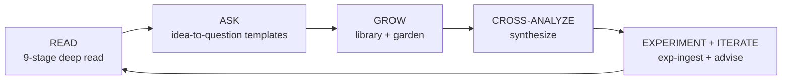
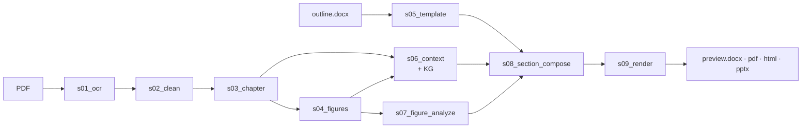

<h1 align="center">lazy-paper</h1>

<p align="center">
  <em>A personal research knowledge base with an AI-scientist loop — reading the paper is only the entry point.</em>
</p>

<p align="center">
  <a href="https://www.python.org/downloads/"></a>
  <a href="LICENSE"></a>
  <a href="CHANGELOG.md"></a>
  <a href="docs/AGENT_GUIDE.md"></a>
</p>

<p align="center"><strong><a href="README.md">English</a> · <a href="README.zh.md">简体中文</a></strong></p>

<p align="center">
  <strong>Latest · <a href="CHANGELOG.md">v2.0.0</a></strong> (2026-06-12)
  <br>
  <sub>knowledge garden · idea incubator · advise loop</sub>
</p>

<p align="center">
  
</p>

---

## What is lazy-paper?

**lazy-paper grows a personal research knowledge base around the papers you read and the experiments you run.** Each deep read is designed to *expand* your ideas rather than merely extract structure: every paper sparks new questions, questions drive cross-paper analysis, analyses connect to your own experiments, and experiment outcomes feed the next round of advice. Analysis quality comes first, always.

The loop has five stations:



### 1 · READ — the nine-stage grounded deep read

One command turns a scientific PDF into a critical reading of it — DOCX · PDF · HTML · PPTX, bilingual, figures and tables embedded, every claim grounded to a source span. Nine deterministic + LLM stages, each independently resumable, every LLM call audited on disk:



- **Grounded, not hallucinated** — every claim cites a span in the source; an LLM verifier rejects unsupported sentences before they ship.
- **Quantitative anchors preserved** — numbers, units, formulas, figure references survive OCR → composition → rendering intact.
- **Bilingual native, four formats, one Document model** — and each of the nine stages drops a `done.yaml`, so tweaking one prompt re-runs only that stage.
- **Agent-friendly** — stages are pure transforms with explicit inputs / outputs; see [`docs/AGENT_GUIDE.md`](docs/AGENT_GUIDE.md) and the full walkthrough in [`docs/ARCHITECTURE.md`](docs/ARCHITECTURE.md).

<p align="center">
  
  
  
</p>

<p align="center">
  
  <br>
  <sub>A Chinese deep read of arXiv 2606.08102 — driven by an auto-generated question template.</sub>
</p>

### 2 · ASK — turn your idea into a question template

`lazy-paper template --idea "..."` drafts a question template matched to your research lens and the paper at hand — your idea drives at least half of the questions. Every section of the template also enforces a `[发散]` (divergent) question: anchored in this paper's evidence, deliberately reaching past its boundary.

<p align="center">
  
  <br>
  <sub>The [发散] question at the end of each section — anchored in this paper's evidence, deliberately stepping out of bounds.</sub>
</p>

### 3 · GROW — a library that becomes a garden

`run --ingest` (or `ingest` on any past run) archives each deep read into a persistent cross-paper library — hybrid dense + BM25 search, knowledge graphs merged, zero extra LLM calls. `lazy-paper garden` then renders the whole library as a star map you can open in a browser — pass `--open` and it launches straight away. The page is a single static `garden.html`, no server: the main star-map canvas works fully offline; only the optional tweaks panel loads React from a CDN and needs a network connection.

<p align="center">
  
  <br>
  <sub>The knowledge-garden star map — papers and experiments are both stars, and the library keeps growing.</sub>
</p>

### 4 · CROSS-ANALYZE — questions that no single paper can ask

`lazy-paper synthesize --topic "..."` gathers evidence across the whole library in both directions — agreements *and* contradictions — and composes a grounded five-section report that must end with **at least 3 new anchored questions**. Two real ones, produced by a synthesize run over a 5-paper library (translated; the original report is in Chinese, `[src:]` markers verbatim):

> If an action-smoothness constraint (e.g. the L2C2-v2 Lipschitz penalty) is injected into the energy-regularization framework, does it improve CoT and joint wear simultaneously within a specific α_en range — or does it create a new conflict with action diversity? [src: atec-b2w-energy-rl Fig.3][src: arxiv-policy-smoothing Fig.3]

> Can MUJICA's DC-motor constraints be recast as a new kind of "physical regularization" term inside energy regularization (rather than a hard constraint), yielding self-adapting gait-switching policies that also account for motor thermal load and lifetime? [src: atec-b2w-mujica-v2 Fig.3][src: atec-b2w-energy-rl Fig.3]

Every claim carries a `[src: paper_id]` marker validated against the library; anything beyond the evidence is labeled `(推测)` (speculation).

### 5 · EXPERIMENT + ITERATE — close the loop with your own data

`lazy-paper exp-ingest` makes experiment bundles (curve images, metrics CSVs, lab notes) first-class library citizens — vision deep-read per curve, deterministic metrics digest, searchable next to papers. `lazy-paper advise` then composes a grounded next-iteration plan with **round memory**: you record what actually happened, and the next round must cite that outcome and must not repeat failed advice.

**Experiment bundle** — a bundle is just a directory; the contract is four lines (full details in [`docs/KNOWLEDGE_BASE.md`](docs/KNOWLEDGE_BASE.md)):

| File / Dir | Required? | What it is |
|---|---|---|
| `exp.yaml` | **required** | Manifest: `title`, `env`, `software`, `hyperparams: {...}`, `papers: [paper_id...]`, `date` |
| `*.md` | optional | Free-form lab notes |
| `*.csv` | optional | Metrics — any CSV with a header row and numeric columns (digest is deterministic, no LLM) |
| `*.png` / `*.jpg` (top level or `curves/`) | optional | Curve images — one vision deep-read each, cached in `exp_notes.yaml` |

<p align="center">
  
  <br>
  <sub>round_01 advice → you record the outcome → round_02 cites that result and avoids repeating failed directions.</sub>
</p>

## Quality & grounding

Three principles, each backed by a concrete mechanism you can inspect on disk:

- **Expand ideas, don't just extract structure** — every paper should leave you with more questions than it answered.
- **Everything generated is grounded** — nothing ships without a citation that a machine has checked.
- **Analysis quality beats feature count** — the whole loop ships with 386+ tests and audit sidecars for every LLM call.

How the grounding actually works, station by station:

| Where | Mechanism |
|---|---|
| READ (s08 compose) | Every composed sentence carries a span-level citation back to the source document; an **anchored-quote verifier** (LLM) rejects unsupported sentences before rendering — author-named external citations must come with a local `cited_quote` or they don't pass |
| synthesize / advise | Every factual claim carries a `[src: paper_id]` / `[src: exp_id]` marker; after composition a **deterministic citation check** scans the report and prints a `WARNING: [src:] markers not in library: ...` line for any id not in the library manifest |
| All generators | Anything beyond the evidence must be labeled `(推测)` (speculation) — the contract is in the prompt and visible in the output |
| Every LLM call | Audit sidecars on disk: a `.prompt.md` (exactly what was sent) and a `.response.json` (exactly what came back) next to the artifact — for run stages, `template`, `synthesize`, `exp-ingest`, and `advise` alike. Sidecars are written *before* the citation check, so a rejected report is always inspectable |
| advise rounds | **Round memory** makes advice hit-rate auditable: every `round_NN/` keeps the plan, its sidecars, and your recorded `outcome.md`; the next round must cite that outcome and must not repeat failed advice |

If a claim looks wrong, you can always answer "where did this come from?" by opening the sidecar next to the file.

## Quickstart

```bash
# Install
curl -LsSf https://astral.sh/uv/install.sh | sh
git clone https://github.com/thematteroftime/lazy-paper && cd lazy-paper
uv python install 3.11 && uv venv --python 3.11
uv pip install -e ".[dev]"
brew install pango gdk-pixbuf libffi cairo   # macOS only — WeasyPrint

# Configure
cp .env.example .env   # fill the tokens — see the table below

# Run (deep-read + ingest into the library in one shot)
uv run python -m cli run \
  --pdf "papers/your-paper.pdf" \
  --template "templates/Table of Contents-CV-IMRaD.docx" \
  --paper-id mypaper --lang zh --formats docx,pdf,html,pptx --ingest
```

Output lands at `runs/<paper-id>/s09_render/preview.{docx,pdf,html,pptx}`.

Then walk the full loop:

```bash
uv run python -m cli template --idea "..." --pdf papers/your-paper.pdf   # ASK: draft a question template from your idea
uv run python -m cli run --pdf ... --template templates/auto-*.docx --paper-id mypaper --ingest   # READ + GROW: deep-read, then ingest
uv run python -m cli synthesize --topic "..."                            # CROSS-ANALYZE: grounded report + >=3 new questions
uv run python -m cli exp-ingest my-exp-01/                               # EXPERIMENT: your curves/metrics/notes join the library
uv run python -m cli advise --exp my-exp-01 --idea "..."                 # ITERATE: grounded next-iteration plan with round memory
uv run python -m cli garden --open                                       # GROW: open the star map of everything so far
```

> **Windows**: prefer the Docker path (`docker compose run --rm lazy-paper run …`) — WeasyPrint needs the GTK runtime which Docker bundles.

## Command reference

Nine subcommands, one per job. Every command supports `-h` for the full flag list; the table shows the flags you'll actually reach for.

| Command | What it does | Key flags | Output lands at |
|---|---|---|---|
| `run` | Full 9-stage deep read of one (PDF, template) pair | `--pdf` + `--template` (required) · `--lang zh\|en` · `--formats docx,pdf,html,pptx` · `--ingest` | `runs/<paper-id>/s09_render/preview.{docx,pdf,html,pptx}` |
| `ingest` | Archive a finished run into the library (zero LLM calls) | `paper_id` (positional) · `--kind paper\|experiment` · `--library-dir` | `library/` (manifest + lancedb + bm25 + `papers/<id>/`) |
| `query` | Hybrid dense + BM25 search across everything ingested | `text` (positional) · `--top-k` · `--papers id1,id2` · `--json` | stdout (use `--json` for agents) |
| `papers` | List the library's contents | `--library-dir` | stdout |
| `remove` | Delete an entry (paper or experiment) from the library — tables, archive, manifest, index | `id` (positional) · `--library-dir` | — |
| `template` | Draft a question-template docx from your idea | `--idea` (required) · `--pdf` *or* `--run` · `--use-library` · `--sections N` | `templates/auto-<idea-slug>.docx` + audit sidecars |
| `synthesize` | Cross-paper research-direction report from the library | `--topic` (required) · `--papers id1,id2` · `--lang zh\|en` · `--top-k` | `library/synth/<topic-slug>/report.md` + audit sidecars |
| `exp-ingest` | Analyze + ingest an experiment bundle | `bundle/` (positional) · `--id` · `--skip-vision` · `--lang zh\|en` | `library/experiments/<id>/` + shared search index |
| `advise` | Grounded next-iteration plan with round memory | `--exp` (required) · `--idea` · `--outcome` · `--top-k` | `library/experiments/<id>/advice/round_NN/report.md` |
| `garden` | Build the static star-map of the whole library | `--open` · `--out DIR` | `library/garden/garden.html` (+ `garden-export.json`) |

## Where everything lives

Two roots: `runs/` is the workshop, `library/` is the vault. Both are user data and gitignored.

| Path | What it is | Can I delete it? |
|---|---|---|
| `runs/<paper-id>/s01_ocr … s09_render/` | Per-stage intermediates of one deep read; each stage drops a `done.yaml` (resume point) plus `.prompt.md` / `.response.json` sidecars for its LLM calls | Yes, once ingested — the library archive is self-contained, and any stage can be re-run from the PDF |
| `runs/<paper-id>/s09_render/preview.*` | The four final outputs: `preview.docx` · `preview.pdf` · `preview.html` · `preview.pptx` | Copy out what you want to keep, then same as above |
| `library/manifest.yaml` | One entry per paper *and* experiment: title, kind, keywords, chunk/entity counts, token totals, source run | **No** — the library is the source of truth |
| `library/lancedb/` | Dense vector tables: `chunks` (text + embeddings), `entities`, `relations` (the merged knowledge graph) | No |
| `library/bm25/` + `bm25_ids.json` | Persisted sparse index over all chunks; rebuilt on every ingest | No (rebuilt automatically, but belongs to the library) |
| `library/papers/<id>/` | Per-paper archive: `context.yaml`, `fig_notes.yaml`, `figures.yaml`, composed `sections/`, OCR `imgs/` — this is what survives `runs/` cleanup | No |
| `library/experiments/<id>/` | Archived experiment bundle (`exp.yaml`, `exp_notes.yaml`, notes, CSVs, `curves/`) + `advice/round_NN/` with reports, sidecars, and your `outcome.md` | No |
| `library/synth/<topic-slug>/` | One folder per synthesize run: `report.md` + audit sidecars | Per-report, your call — nothing else depends on it |
| `library/garden/` | The built star map: `garden.html` + `garden-export.json` + JS assets | Yes — `lazy-paper garden` regenerates it from the library |
| `templates/auto-*.docx` | Generated question templates (plain Word — edit freely) with `.prompt.md` / `.response.json` sidecars beside each | Your call — they're inputs, not state |

## Get the API keys

Sign up once per role, paste the key into `.env`.

| Role | Provider | Sign-up | `.env` |
|---|---|---|---|
| **OCR** (default) | MinerU cloud | <https://mineru.net> · account → API tokens | `MINERU_TOKEN` |
| **OCR** (alt) | PaddleOCR-VL · Baidu AI Studio | <https://aistudio.baidu.com/paddleocr> | `PADDLEOCR_TOKEN` |
| **Text LLM** | DeepSeek-Reasoner | <https://platform.deepseek.com> · API keys | `LLM_TEXT_API_KEY` |
| **Vision LLM** | Qwen-VL · Aliyun Bailian | <https://bailian.console.aliyun.com/> · API-KEY | `LLM_VISION_API_KEY` |

All four are OpenAI-compatible; point `LLM_*_BASE_URL` + `LLM_*_MODEL` elsewhere (OpenAI / vLLM / Ollama / Anthropic-gateway) if you prefer.

## Pick the template — the single most load-bearing choice

Or don't pick at all — let the system draft one for you: `lazy-paper template --idea "..." --pdf <paper>` generates a matched question template from your idea (see `docs/TEMPLATE_AUTHORING.md` and **ASK** above).

If you do pick by hand, choose carefully. **The template's section headings are inserted verbatim into the compose prompt.** Hand "Dielectric Properties of Relaxor AFE" to an unCLIP image-generation paper, and the LLM either declines or — worse — stuffs unCLIP content under the wrong section. Same paper, same model, same prompt: **a wrong template can swing RAGAS faithfulness from 0.81 to 0.10.** This is not optional.

| Template (`templates/<file>`) | Best for |
|---|---|
| `Table of Contents-CV-IMRaD.docx` | Generic CV / ML / IMRaD papers (Intro → Method → Experiments → Results → Discussion) |
| `Table of Contents-Relaxor AFE-ZGY-HW.docx` | Materials science (ferroelectrics, energy storage) |
| `Table of Contents-ATEC-B2w-Reward-ZGY.docx` | RL reward design for legged / wheeled-legged robots (ATEC2026 B2w energy regularization) |
| `Table of Contents-ATEC-B2w-MUJICA-v2-ZGY.docx` | Multi-skill unified RL (energy + skill selector + DC-motor constraints) |
| `Table of Contents-MD-Reproduction.docx` | Molecular-dynamics paper reproduction — extracts numbers, equations, and unit conventions verbatim to drive a downstream MD run |

For a new domain copy the closest match and rewrite the section headings. There is **no "good enough generic"** — the wrong template quietly degrades every downstream stage.

## Output formats at a glance

| Format | Highlights |
|---|---|
| `docx` | Word file, Songti + Times New Roman. design tokens: accent `#D97757` chapter numbers + left border, gray captions, accent-bordered `深度观察` aside |
| `pdf` | WeasyPrint over the same HTML; `@media print` strips topbar / TOC; math as italic-serif Unicode fallback |
| `html` | Single file with base64 images. Sticky topbar + right-rail TOC + 3 accent themes + KaTeX math + copy-on-click LaTeX. Set `LAZY_PAPER_INLINE_KATEX=1` for fully offline single-file (~1.08 MB) |
| `pptx` | Academic-defense styled: cream / charcoal, LLM-grouped 4–5 section outline, bullets + figure pairs, quantitative closing |

<p align="center">
  
</p>

## Docs

| File | Audience |
|---|---|
| [`docs/USER_GUIDE.md`](docs/USER_GUIDE.md) · [`docs_zh/`](docs_zh/USER_GUIDE.md) | End user — setup, iteration, troubleshooting |
| [`docs/ARCHITECTURE.md`](docs/ARCHITECTURE.md) · [`docs_zh/`](docs_zh/ARCHITECTURE.md) | Maintainer — per-stage contracts, retrieval, verifier |
| [`docs/AGENT_GUIDE.md`](docs/AGENT_GUIDE.md) · [`docs_zh/`](docs_zh/AGENT_GUIDE.md) | AI coding agent — workflow + anti-patterns |
| [`docs/KNOWLEDGE_BASE.md`](docs/KNOWLEDGE_BASE.md) · [`docs_zh/`](docs_zh/KNOWLEDGE_BASE.md) | The whole loop — library · synthesize · experiments · advise · garden |
| [`docs/TEMPLATE_AUTHORING.md`](docs/TEMPLATE_AUTHORING.md) · [`docs_zh/`](docs_zh/TEMPLATE_AUTHORING.md) | Generate a question template from your idea |
| [`templates/`](templates/) | Five ready-to-use outline templates |
| [`examples/`](examples/) | Three reference outputs (energy-RL · MUJICA · PRX nonreciprocal MD) — open any folder's `preview.html` to see what lazy-paper produces |
| [`CHANGELOG.md`](CHANGELOG.md) · [`CONTRIBUTING.md`](CONTRIBUTING.md) | Release notes · contribution norms |

## License

MIT — see [`LICENSE`](LICENSE). Built on [MinerU](https://github.com/opendatalab/MinerU), [PaddleOCR](https://github.com/PaddlePaddle/PaddleOCR), [DeepSeek](https://www.deepseek.com/), [Qwen](https://github.com/QwenLM/Qwen), [WeasyPrint](https://github.com/Kozea/WeasyPrint), [python-pptx](https://github.com/scanny/python-pptx), [python-docx](https://github.com/python-openxml/python-docx).

```bibtex
@software{lazy_paper,
  author  = {thematteroftime},
  title   = {lazy-paper: a personal research knowledge base with an AI-scientist loop},
  url     = {https://github.com/thematteroftime/lazy-paper},
  version = {2.0.0},
  year    = {2026}
}
```
