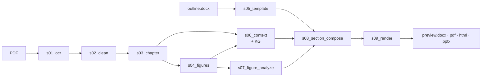

<h1 align="center">lazy-paper</h1>

<p align="center">
  <em>一条命令，把科研 PDF 变成结构化的多格式深度解读。</em>
</p>

<p align="center">
  <a href="https://www.python.org/downloads/"></a>
  <a href="LICENSE"></a>
  <a href="CHANGELOG.md"></a>
  <a href="docs_zh/AGENT_GUIDE.md"></a>
</p>

<p align="center"><strong><a href="README.md">English</a> · <a href="README.zh.md">简体中文</a></strong></p>

<p align="center">
  <strong>最新版本 · <a href="CHANGELOG.md">v1.13-render</a></strong>（2026-06-03）
  <br>
  <sub>KaTeX HTML · accent 调色 DOCX · MinerU chart 类型修复 · 罗马数字章节探测</sub>
</p>

<p align="center">
  
</p>

---

## lazy-paper 是什么

**一条命令，把一篇科研 PDF 变成对它的批判式深读 —— DOCX · PDF · HTML · PPTX 四种格式、中英双语、图表内嵌、每一句结论都锚回原文。** 不需要写 prompt、不需要手动排版、不需要跨工具来回复制粘贴。

它由 9 个确定性 + LLM 阶段组成：OCR → 清洗 → 章节划分 → 图表索引 → 上下文 + KG → 视觉 LLM 图分析 → 有据可查的章节撰写 → 4 格式渲染。每个阶段独立可重跑；每次 LLM 调用的 prompt 和 response 都落盘，整个流程可审计。



### 为什么用它

- **有据可查、不是胡说。** 每条 claim 都引用原文 span；LLM verifier 在产出前就否决未支持的句子。
- **量化锚点不丢。** 数字、单位、公式、图号在 OCR → 撰写 → 渲染全链路里保留原样。
- **四格式同源。** DOCX、PDF（WeasyPrint）、HTML（KaTeX）、PPTX（学术答辩风）共用一份 Document model。
- **双语原生。** CLI 一个 `--lang` 切换；模板、图分析、引用标记都本地化。
- **可断点续跑。** 9 个 stage 各落 `done.yaml`，改一句 prompt 只重跑那一个 stage。
- **Agent 友好。** Stage 是纯转换、输入输出显式；[`docs_zh/AGENT_GUIDE.md`](docs_zh/AGENT_GUIDE.md) 为 Claude / Copilot / Cursor 等给出协作契约。

完整逐阶段详解：[`docs_zh/ARCHITECTURE.md`](docs_zh/ARCHITECTURE.md)。

## 输出长什么样

**PDF / DOCX / HTML** — 共享同一套 design tokens（accent `#D97757`、serif 标题、accent 边深度观察块）：

<p align="center">
  
  
  
</p>

**PPTX** — 学术答辩风、字号随密度自适应、LLM 分组的节分隔片：

<p align="center">
  
</p>


## 快速开始

```bash
# 安装
curl -LsSf https://astral.sh/uv/install.sh | sh
git clone https://github.com/thematteroftime/lazy-paper && cd lazy-paper
uv python install 3.11 && uv venv --python 3.11
uv pip install -e ".[dev]"
brew install pango gdk-pixbuf libffi cairo   # macOS · WeasyPrint 依赖

# 配置
cp .env.example .env   # 填 token，见下表

# 运行
uv run python -m cli run \
  --pdf "papers/your-paper.pdf" \
  --template "templates/Table of Contents-CV-IMRaD.docx" \
  --paper-id mypaper --lang zh --formats docx,pdf,html,pptx
```

产物在 `runs/<paper-id>/s09_render/preview.{docx,pdf,html,pptx}`。

> **Windows 用户**：建议走 Docker（`docker compose run --rm lazy-paper run …`），WeasyPrint 依赖 GTK runtime。

## 申请 API key

每个角色注册一次，把 key 填进 `.env` 就行。

| 角色 | 服务商 | 注册链接 | `.env` 字段 |
|---|---|---|---|
| **OCR**（默认） | MinerU 云 | <https://mineru.net> · 账户 → API tokens | `MINERU_TOKEN` |
| **OCR**（备选） | 百度 AI Studio · PaddleOCR-VL | <https://aistudio.baidu.com/paddleocr> | `PADDLEOCR_TOKEN` |
| **文本 LLM** | DeepSeek-Reasoner | <https://platform.deepseek.com> · API keys | `LLM_TEXT_API_KEY` |
| **视觉 LLM** | 阿里云百炼 · Qwen-VL | <https://bailian.console.aliyun.com/> · API-KEY | `LLM_VISION_API_KEY` |

四项都是 OpenAI 兼容协议；换 OpenAI / vLLM / Ollama / Anthropic 网关只需改 `LLM_*_BASE_URL` + `LLM_*_MODEL`。

## 选对模板——整个流程最关键的一步

**模板的章节标题会原文塞进 compose prompt。** 拿"Dielectric Properties of Relaxor AFE"去跑 unCLIP 图像生成论文，LLM 要么写一段越界声明、要么把 unCLIP 内容硬塞进错误标题之下。同一篇论文、同一模型、同一 prompt：**一个错模板能把 RAGAS faithfulness 从 0.81 拉到 0.10。** 这不是可选项。

| 模板（`templates/<文件>`） | 适用领域 |
|---|---|
| `Table of Contents-CV-IMRaD.docx` | 通用 CV / ML / IMRaD（Intro → Method → Experiments → Results → Discussion） |
| `Table of Contents-Relaxor AFE-ZGY-HW.docx` | 材料科学（铁电、储能） |
| `Table of Contents-ATEC-B2w-Reward-ZGY.docx` | 腿足/轮足机器人 RL 奖励设计（ATEC2026 B2w 能耗正则化） |
| `Table of Contents-ATEC-B2w-MUJICA-v2-ZGY.docx` | 多技能统一 RL（能耗 + 技能选择器 + DC 电机约束） |

新领域复制最近邻的一份，改章节标题。**没有"通用够用"的模板**——错模板会安静地拖垮下游每个阶段。

也可以完全跳过挑选：`lazy-paper template --idea "..." --pdf <论文>` 会为你生成一份匹配的问题模板（见 `docs_zh/TEMPLATE_AUTHORING.md`）。

## 输出格式一览

| 格式 | 要点 |
|---|---|
| `docx` | Word 文档，宋体 + Times New Roman。v1.13 design tokens：accent `#D97757` 章节编号 + 左侧竖条、次级灰图说、accent 边深度观察块 |
| `pdf` | WeasyPrint 渲染同套 HTML；`@media print` 屏蔽 topbar / TOC；公式 italic serif Unicode 兜底 |
| `html` | 单文件、图像 base64 内嵌。Sticky topbar + 右侧 TOC + 3 套强调色主题 + KaTeX 公式 + 点击复制 TeX。设 `LAZY_PAPER_INLINE_KATEX=1` 全离线（~1.08 MB） |
| `pptx` | 学术答辩风：奶白 / 炭黑、LLM 分组 4–5 节目录、图文并排、含定量结论 |

## 文档地图

| 文件 | 受众 |
|---|---|
| [`docs_zh/USER_GUIDE.md`](docs_zh/USER_GUIDE.md) · [`docs/`](docs/USER_GUIDE.md) | 终端用户 —— 配置、迭代、排障 |
| [`docs_zh/ARCHITECTURE.md`](docs_zh/ARCHITECTURE.md) · [`docs/`](docs/ARCHITECTURE.md) | 维护者 —— 9 阶段契约、检索器、verifier |
| [`docs_zh/AGENT_GUIDE.md`](docs_zh/AGENT_GUIDE.md) · [`docs/`](docs/AGENT_GUIDE.md) | AI 编程 agent —— 工作流与反模式 |
| [`docs_zh/KNOWLEDGE_BASE.md`](docs_zh/KNOWLEDGE_BASE.md) · [`docs/`](docs/KNOWLEDGE_BASE.md) | 跨论文知识库 —— 入库与检索 |
| [`docs_zh/TEMPLATE_AUTHORING.md`](docs_zh/TEMPLATE_AUTHORING.md) · [`docs/`](docs/TEMPLATE_AUTHORING.md) | 由你的想法生成问题模板 |
| [`templates/`](templates/) | 4 份现成 outline 模板 |
| [`examples/`](examples/) | 3 份参考产物（energy-RL · MUJICA · PRX 非互反 MD）—— 任一子目录的 `preview.html` 浏览器打开即看产出效果 |
| [`CHANGELOG.md`](CHANGELOG.md) · [`CONTRIBUTING.md`](CONTRIBUTING.md) | 版本变更 · 贡献约定 |

## 许可证

MIT —— 见 [`LICENSE`](LICENSE)。基于 [MinerU](https://github.com/opendatalab/MinerU)、[PaddleOCR](https://github.com/PaddlePaddle/PaddleOCR)、[DeepSeek](https://www.deepseek.com/)、[Qwen](https://github.com/QwenLM/Qwen)、[WeasyPrint](https://github.com/Kozea/WeasyPrint)、[python-pptx](https://github.com/scanny/python-pptx)、[python-docx](https://github.com/python-openxml/python-docx) 构建。

```bibtex
@software{lazy_paper,
  author  = {thematteroftime},
  title   = {lazy-paper: PDF research papers to multi-format deep analysis},
  url     = {https://github.com/thematteroftime/lazy-paper},
  version = {1.13-render},
  year    = {2026}
}
```
