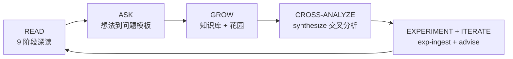
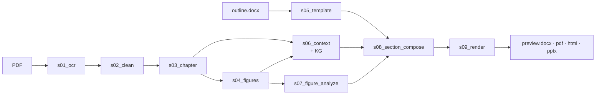
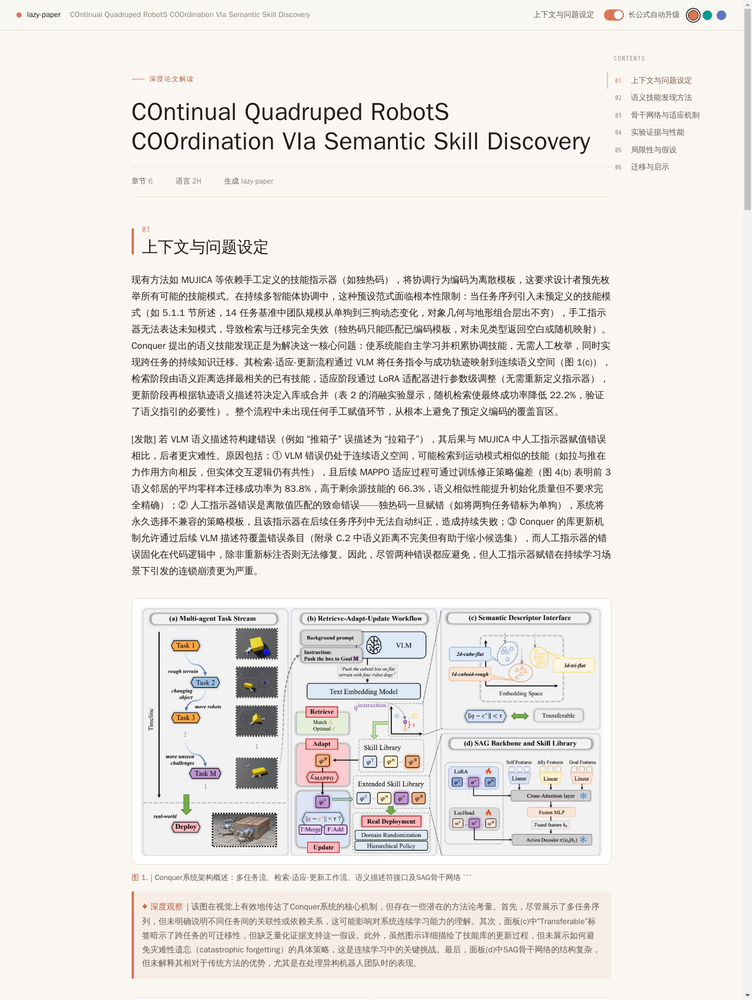
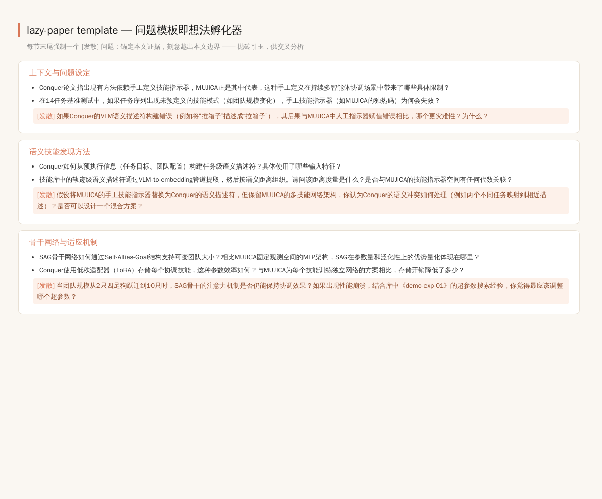
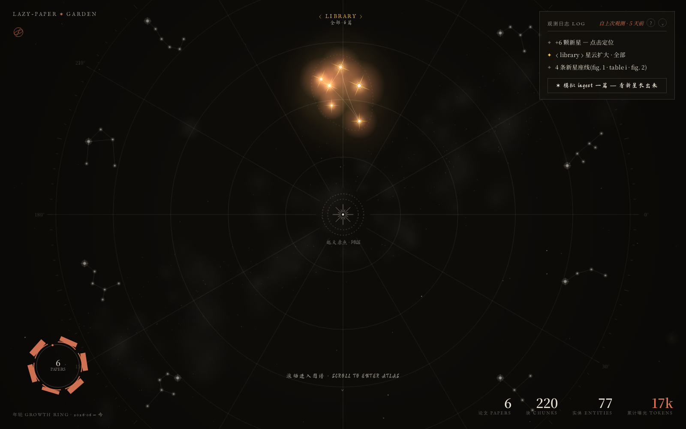
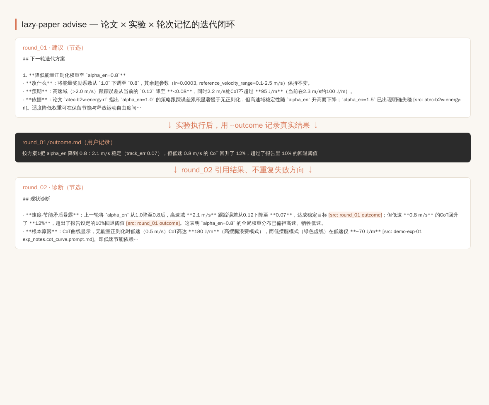

<h1 align="center">lazy-paper</h1>

<p align="center">
  <em>个人科研知识库 + AI 科学家闭环 —— 读论文，只是入口。</em>
</p>

<p align="center">
  <a href="https://www.python.org/downloads/"></a>
  <a href="LICENSE"></a>
  <a href="CHANGELOG.md"></a>
  <a href="docs_zh/AGENT_GUIDE.md"></a>
</p>

<p align="center"><strong><a href="README.md">English</a> · <a href="README.zh.md">简体中文</a></strong></p>

<p align="center">
  <strong>最新版本 · <a href="CHANGELOG.md">v1.19-garden</a></strong>（2026-06-12）
  <br>
  <sub>知识花园 · 想法孵化器 · advise 迭代闭环</sub>
</p>

<p align="center">
  
</p>

---

## lazy-paper 是什么

**lazy-paper 围绕你读的论文和你做的实验，生长出一座属于你自己的科研知识库。** 它的设计目标是扩展想法，而不是结构化提取：每一篇论文都该抛砖引玉、生出更多问题；问题驱动跨论文交叉分析；分析连接你自己的实验；实验结果再喂回下一轮建议。分析质量永远排在第一位。

整个闭环有五站：



### 1 · READ —— 9 阶段有据可查的深读

一条命令把科研 PDF 变成对它的批判式深读 —— DOCX · PDF · HTML · PPTX 四格式、中英双语、图表内嵌、每句结论锚回原文。9 个确定性 + LLM 阶段，各自可断点续跑，每次 LLM 调用的 prompt 与 response 都落盘可审计：



- **有据可查、不是胡说** —— 每条 claim 引用原文 span；LLM verifier 在产出前就否决未支持的句子。
- **量化锚点不丢** —— 数字、单位、公式、图号在 OCR → 撰写 → 渲染全链路保留原样。
- **双语原生、四格式同源** —— 共用一份 Document model；9 个 stage 各落 `done.yaml`，改一句 prompt 只重跑那一个。
- **Agent 友好** —— stage 是输入输出显式的纯转换；协作契约见 [`docs_zh/AGENT_GUIDE.md`](docs_zh/AGENT_GUIDE.md)，逐阶段详解见 [`docs_zh/ARCHITECTURE.md`](docs_zh/ARCHITECTURE.md)。

<p align="center">
  
  
  
</p>

<p align="center">
  
  <br>
  <sub>arXiv 2606.08102 的中文深读 —— 由自动生成的问题模板驱动。</sub>
</p>

### 2 · ASK —— 把你的想法变成问题模板

`lazy-paper template --idea "..."` 根据你的研究视角和手头论文起草一份匹配的问题模板 —— 你的想法驱动至少一半的问题。自 v1.19 起，模板的每一节还强制带一个 `[发散]` 问题：锚定本文证据，刻意越出本文边界。

<p align="center">
  
  <br>
  <sub>每节末尾的 [发散] 问题 —— 锚定本文证据，刻意越出边界。</sub>
</p>

### 3 · GROW —— 知识库长成知识花园

`run --ingest`（或对任意历史 run 执行 `ingest`）把每次深读归档进持久化的跨论文知识库 —— 混合 dense + BM25 检索、知识图谱合并、零额外 LLM 调用。再用 `lazy-paper garden` 把整座库渲染成可在浏览器里打开的星图。

<p align="center">
  
  <br>
  <sub>知识库星图 —— 论文与实验都是恒星，库在生长。</sub>
</p>

### 4 · CROSS-ANALYZE —— 提出任何一篇论文单独问不出的问题

`lazy-paper synthesize --topic "..."` 在整座库上双向收集证据 —— 共识与分歧并重 —— 撰写一份有据可查的五节报告，并且必须以**至少 3 个新的锚定问题**收尾。下面是 5 篇库实测产出的其中 2 条（原文照录，含 `[src:]` 标记）：

> 在能量正则化框架中引入动作平滑性约束（如L2C2-v2的Lipschitz惩罚）是否会在特定α_en区间内同时改善CoT和关节磨损，还是会在动作多样性上产生新的冲突？[src: atec-b2w-energy-rl Fig.3][src: arxiv-policy-smoothing Fig.3]

> MUJICA框架的DC电机约束是否可以作为能量正则化的一种新型"物理正则化"项（而非仅作为硬约束）引入，从而实现自我适应的步态与切换策略，同时自动考虑电机热负荷和寿命？[src: atec-b2w-mujica-v2 Fig.3][src: atec-b2w-energy-rl Fig.3]

每条 claim 都带 `[src: paper_id]` 标记并与库 manifest 校验；超出证据的内容一律标注 `(推测)`。

### 5 · EXPERIMENT + ITERATE —— 用你自己的数据闭环

`lazy-paper exp-ingest` 让实验包（曲线图、指标 CSV、实验笔记）成为知识库的一等公民 —— 每条曲线做视觉深读、指标做确定性摘要、与论文同库可检索。`lazy-paper advise` 随后给出有据可查的下一轮迭代方案，并带**轮次记忆**：你记录真实结果，下一轮必须引用该结果、且不得重复已失败的建议。

<p align="center">
  
  <br>
  <sub>round_01 给建议 → 你记录 outcome → round_02 引用该结果且不重复失败方向。</sub>
</p>

## 设计原则

- **扩展想法 > 结构化提取** —— 读完一篇论文，留下的问题应该比它回答的更多。
- **一切生成必须 grounded** —— `[src:]` 标记、确定性引用校验、span 锚定验证、超出证据一律标 `(推测)`。
- **分析质量优先于功能数量** —— 整条闭环带 380+ 测试，每次 LLM 调用都有审计侧车。

## 快速开始

```bash
# 安装
curl -LsSf https://astral.sh/uv/install.sh | sh
git clone https://github.com/thematteroftime/lazy-paper && cd lazy-paper
uv python install 3.11 && uv venv --python 3.11
uv pip install -e ".[dev]"
brew install pango gdk-pixbuf libffi cairo   # macOS · WeasyPrint 依赖

# 配置
cp .env.example .env   # 填 token，见下表

# 运行（深读 + 一并入库）
uv run python -m cli run \
  --pdf "papers/your-paper.pdf" \
  --template "templates/Table of Contents-CV-IMRaD.docx" \
  --paper-id mypaper --lang zh --formats docx,pdf,html,pptx --ingest
```

产物在 `runs/<paper-id>/s09_render/preview.{docx,pdf,html,pptx}`。

然后走完整个闭环：

```bash
uv run python -m cli template --idea "..." --pdf papers/your-paper.pdf   # ASK：由你的想法起草问题模板
uv run python -m cli run --pdf ... --template templates/auto-*.docx --paper-id mypaper --ingest   # READ + GROW：深读并入库
uv run python -m cli synthesize --topic "..."                            # CROSS-ANALYZE：交叉报告 + >=3 个新问题
uv run python -m cli exp-ingest my-exp-01/                               # EXPERIMENT：曲线/指标/笔记进库
uv run python -m cli advise --exp my-exp-01 --idea "..."                 # ITERATE：带轮次记忆的下一轮迭代方案
uv run python -m cli garden --open                                       # GROW：打开你的知识星图
```

> **Windows 用户**：建议走 Docker（`docker compose run --rm lazy-paper run …`），WeasyPrint 依赖 GTK runtime。

## 申请 API key

每个角色注册一次，把 key 填进 `.env` 就行。

| 角色 | 服务商 | 注册链接 | `.env` 字段 |
|---|---|---|---|
| **OCR**（默认） | MinerU 云 | <https://mineru.net> · 账户 → API tokens | `MINERU_TOKEN` |
| **OCR**（备选） | 百度 AI Studio · PaddleOCR-VL | <https://aistudio.baidu.com/paddleocr> | `PADDLEOCR_TOKEN` |
| **文本 LLM** | DeepSeek-Reasoner | <https://platform.deepseek.com> · API keys | `LLM_TEXT_API_KEY` |
| **视觉 LLM** | 阿里云百炼 · Qwen-VL | <https://bailian.console.aliyun.com/> · API-KEY | `LLM_VISION_API_KEY` |

四项都是 OpenAI 兼容协议；换 OpenAI / vLLM / Ollama / Anthropic 网关只需改 `LLM_*_BASE_URL` + `LLM_*_MODEL`。

## 选对模板——整个流程最关键的一步

也可以不挑——直接让系统为你生成：`lazy-paper template --idea "..." --pdf <论文>` 会由你的想法起草一份匹配的问题模板（见 `docs_zh/TEMPLATE_AUTHORING.md` 与上文 **ASK** 一节）。

如果手动挑，请认真挑。**模板的章节标题会原文塞进 compose prompt。** 拿"Dielectric Properties of Relaxor AFE"去跑 unCLIP 图像生成论文，LLM 要么写一段越界声明、要么把 unCLIP 内容硬塞进错误标题之下。同一篇论文、同一模型、同一 prompt：**一个错模板能把 RAGAS faithfulness 从 0.81 拉到 0.10。** 这不是可选项。

| 模板（`templates/<文件>`） | 适用领域 |
|---|---|
| `Table of Contents-CV-IMRaD.docx` | 通用 CV / ML / IMRaD（Intro → Method → Experiments → Results → Discussion） |
| `Table of Contents-Relaxor AFE-ZGY-HW.docx` | 材料科学（铁电、储能） |
| `Table of Contents-ATEC-B2w-Reward-ZGY.docx` | 腿足/轮足机器人 RL 奖励设计（ATEC2026 B2w 能耗正则化） |
| `Table of Contents-ATEC-B2w-MUJICA-v2-ZGY.docx` | 多技能统一 RL（能耗 + 技能选择器 + DC 电机约束） |

新领域复制最近邻的一份，改章节标题。**没有"通用够用"的模板**——错模板会安静地拖垮下游每个阶段。

## 输出格式一览

| 格式 | 要点 |
|---|---|
| `docx` | Word 文档，宋体 + Times New Roman。v1.13 design tokens：accent `#D97757` 章节编号 + 左侧竖条、次级灰图说、accent 边深度观察块 |
| `pdf` | WeasyPrint 渲染同套 HTML；`@media print` 屏蔽 topbar / TOC；公式 italic serif Unicode 兜底 |
| `html` | 单文件、图像 base64 内嵌。Sticky topbar + 右侧 TOC + 3 套强调色主题 + KaTeX 公式 + 点击复制 TeX。设 `LAZY_PAPER_INLINE_KATEX=1` 全离线（~1.08 MB） |
| `pptx` | 学术答辩风：奶白 / 炭黑、LLM 分组 4–5 节目录、图文并排、含定量结论 |

<p align="center">
  
</p>

## 文档地图

| 文件 | 受众 |
|---|---|
| [`docs_zh/USER_GUIDE.md`](docs_zh/USER_GUIDE.md) · [`docs/`](docs/USER_GUIDE.md) | 终端用户 —— 配置、迭代、排障 |
| [`docs_zh/ARCHITECTURE.md`](docs_zh/ARCHITECTURE.md) · [`docs/`](docs/ARCHITECTURE.md) | 维护者 —— 9 阶段契约、检索器、verifier |
| [`docs_zh/AGENT_GUIDE.md`](docs_zh/AGENT_GUIDE.md) · [`docs/`](docs/AGENT_GUIDE.md) | AI 编程 agent —— 工作流与反模式 |
| [`docs_zh/KNOWLEDGE_BASE.md`](docs_zh/KNOWLEDGE_BASE.md) · [`docs/`](docs/KNOWLEDGE_BASE.md) | 跨论文知识库 —— 入库与检索 |
| [`docs_zh/TEMPLATE_AUTHORING.md`](docs_zh/TEMPLATE_AUTHORING.md) · [`docs/`](docs/TEMPLATE_AUTHORING.md) | 由你的想法生成问题模板 |
| [`templates/`](templates/) | 4 份现成 outline 模板 |
| [`examples/`](examples/) | 3 份参考产物（energy-RL · MUJICA · PRX 非互反 MD）—— 任一子目录的 `preview.html` 浏览器打开即看产出效果 |
| [`CHANGELOG.md`](CHANGELOG.md) · [`CONTRIBUTING.md`](CONTRIBUTING.md) | 版本变更 · 贡献约定 |

## 许可证

MIT —— 见 [`LICENSE`](LICENSE)。基于 [MinerU](https://github.com/opendatalab/MinerU)、[PaddleOCR](https://github.com/PaddlePaddle/PaddleOCR)、[DeepSeek](https://www.deepseek.com/)、[Qwen](https://github.com/QwenLM/Qwen)、[WeasyPrint](https://github.com/Kozea/WeasyPrint)、[python-pptx](https://github.com/scanny/python-pptx)、[python-docx](https://github.com/python-openxml/python-docx) 构建。

```bibtex
@software{lazy_paper,
  author  = {thematteroftime},
  title   = {lazy-paper: a personal research knowledge base with an AI-scientist loop},
  url     = {https://github.com/thematteroftime/lazy-paper},
  version = {1.19-garden},
  year    = {2026}
}
```
