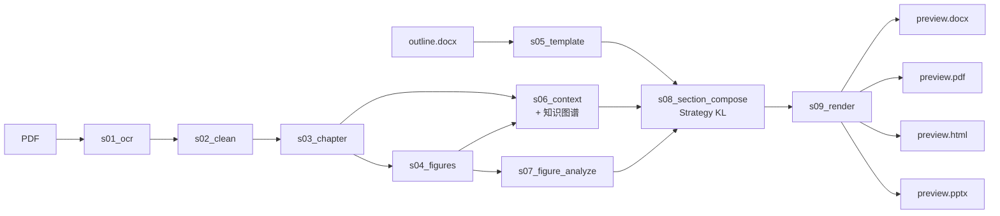

<h1 align="center">lazy-paper</h1>

<p align="center">
  <em>一条命令，把科研 PDF 转成结构化的多格式深度分析。</em>
</p>

<p align="center">
  <a href="https://www.python.org/downloads/"></a>
  <a href="LICENSE"></a>
  <a href="CHANGELOG.md"></a>
  <a href="#测试"></a>
  <a href="docs_zh/AGENT_GUIDE.md"></a>
</p>

<p align="center"><strong><a href="README.md">English</a> · <a href="README.zh.md">简体中文</a></strong></p>

<p align="center">
  
  <br>
  <em>一份 PDF · 9 阶段（确定性+LLM 混合）· 四种精修产物。</em>
</p>

---

## 它做什么

喂入一篇科研 PDF + 一份 `.docx` 章节大纲模板，得到 **DOCX · PDF · HTML · PPTX** —— 中英双语深度分析，图表、量化锚点完整保留。

```
                                                  ┌──▶ preview.docx
PDF  +  outline.docx                              │
       │                                          ├──▶ preview.pdf
       ▼                                          │
  s01_ocr  ▶  s02_clean  ▶  s03_chapter ┐         ├──▶ preview.html
                                        │         │
  s04_figures ─────────┐                ├─▶ s09 ──┴──▶ preview.pptx
                       ├─▶ s06_context ─┤
  s05_template ────────┤    (+ KG)      │
                       │                │
  s07_figure_analyze ──┴─▶ s08_section_compose
                              (Strategy KL：检索器 + 校验器 + 重试)
```



每个阶段写 `done.yaml`、可断点续跑；每次 LLM 调用持久化 prompt 与 response 供追溯。

## 真实数据流动示例

上面的架构图说明了形状，下面的示例说明了内容 —— 每一段都是 `runs/meng2024_v110_demo/` 的原样切片（ACS Appl. Mater. Interfaces 2024 的 NBT 基 RFE 论文）。读完一遍就知道自己的 PDF 会被如何处理。

### s01 → s02 —— OCR、然后规范化

**输入** `papers/meng2024.pdf`（16 页、含图）。MinerU 逐页返回 markdown，lazy-paper 拼成 `s01_ocr/doc_*.md`。

```text
runs/meng2024_v110_demo/s01_ocr/doc_5.md
... $$$$
where $\varepsilon_{r(T)}$ is the $\varepsilon_r$ at various temperatures ...
```

**这一步做什么。** s02 把 OCR 失败留下的空 `$$$$` 公式块、错位的多栏文本剔除成注释，正文不动。

```text
runs/meng2024_v110_demo/s02_clean/doc_5.md
... <!-- corrupted-column-flow -->
where $\varepsilon_{r(T)}$ is the $\varepsilon_r$ at various temperatures ...
```

**判断点。** 下游若拿到空 LaTeX 块，DOCX/PDF 渲染会直接报错；改成注释而不是静默删除，人工复查清洁化产物时可以一眼看到原本哪里有数据。

### s03 —— 章节聚合

**输入** 全部 `s02_clean/doc_*.md`。lazy-paper 识别 `# 1. INTRODUCTION`、`## 2. EXPERIMENTAL SECTION` 风格的标题，把连续页面聚成章节文件。

**输出**

```yaml
# runs/meng2024_v110_demo/s03_chapter/chapter_index.yaml
- chapter_no: 1
  title: INTRODUCTION
  file: chapter_001_INTRODUCTION.md
  sources: [doc_0.md, doc_1.md, doc_10.md, doc_11.md]
  chars: 14929
- chapter_no: 5
  title: RESULTS AND DISCUSSION
  file: chapter_005_RESULTS_AND_DISCUSSION.md
  sources: [doc_2.md, doc_3.md, doc_5.md, doc_6.md, doc_7.md, doc_8.md, doc_9.md]
  chars: 22129
```

**判断点。** 每章记录其 source 页号，后续 s06/s08 检索可以把候选集限定在正确分块，而非全文搜索。

### s04 —— 图、引用、表

三份产物，下游都要用：

```yaml
# s04_figures/figures.yaml —— Fig. 1 entry
- fig_id: Fig. 1
  image_rel_path: imgs/img_mineru_005.jpg
  caption: Schematic diagram of the synergistic optimization strategy ...
  source_doc: doc_1.md

# s04_figures/mentions.yaml —— 章节 ↔ 图 交叉索引
chapter_005_RESULTS_AND_DISCUSSION.md:
  - Fig. 2a
  - Fig. 11
  - Fig. 12
  - Fig. 13
  ...
```

**判断点 —— caption-stub 过滤（v1.11.1）。** 某些 OCR 切分会把无意义片段（`(a)`、`A high quality photo of a dog playing in a green field`）当成图 caption。v1.11.1 起，未通过 stub-detector 的 caption 在 s07 视觉 LLM 调用前就被剔除。在跨域 unCLIP 论文（`runs/hif_2_v111_demo/`）上，该过滤丢掉了 46 条图条目中的 2 条 —— `Fig. 43` 的两条 prompt-stub caption；v1.10 会白白浪费两次视觉 LLM 调用。

### s05 —— 大纲模板

**输入** 用户给的 `Table of Contents-Relaxor AFE-ZGY-HW.docx`（领域引导）。lazy-paper 把它解析成节点树，guidance 中的 `{paper.system}`、`{paper.figures}`、`{paper.key_terms}` 用 Jinja 风格占位。

```yaml
# s05_template/template.yaml
- level: 1
  title: Introduction
  guidance: |
    (Research background and motivation: {paper.system})
    Antiferroelectrics
    Describe the fundamental characteristics of antiferroelectrics (AFE): crystal
    structure, P-E hysteresis loop, phase transition behavior ...
    Identify which AFE category {paper.system} belongs to. Draw on key terms
    {paper.keywords}.
  hints: {needs_table: false, needs_figure: false}
```

**判断点。** 模板表达"这节应该讲什么"，占位会在 s06 的 `context.yaml` 上解析；同一份模板可以套用同领域的任意论文。

### s06 —— Context + 11 类 KG

**输入** s03 的标题、摘要、引言章节。**输出** 结构化论文资料卡 + 强类型小型知识图谱。

```yaml
# s06_context/context.yaml （v1.11.1）
title: Superior Energy-Storage Performances ... AFE-like Na0.5Bi0.5TiO3-Based RFE ...
system: (1-x)(Na0.3Bi0.38Sr0.28TiO3)-xBi(Mg0.5Zr0.5)O3 (x = 0.00 ... 0.20) ceramics
abbreviations:
  - {abbr: NBST, expansion: Na0.3Bi0.38Sr0.28TiO3}
  - {abbr: BMZ,  expansion: Bi(Mg0.5Zr0.5)O3}
  - {abbr: W_rec, expansion: recoverable energy density}
key_terms: [antiferroelectric-like, relaxor ferroelectric, defect dipole, ...]
headline_metrics:                              # ← v1.11.1 修复
  flagship: 0.85(Na0.3Bi0.38Sr0.28TiO3)-0.15Bi(Mg0.5Zr0.5)O3
  W_rec: '5.00'
  η: '90.09'
```

```text
# s06_context/paper_kg.parquet —— 35 个实体，24 条关系
material  m_85NBST15BMZ   0.85(Na0.3Bi0.38Sr0.28TiO3)-0.15Bi(Mg0.5Zr0.5)O3
dopant    d_BMZ           Bi(Mg0.5Zr0.5)O3
parameter p_Wrec          W_rec
value     v_main_Wrec     5.00
unit      u_Jcm3          J/cm³
# rel: m_85NBST15BMZ —[has_W_rec]→ v_main_Wrec
```

**判断点 —— headline_metrics（v1.11.1 修复）。** v1.11.1 之前，prompt 过长时摘要抽取会丢 `flagship / W_rec / η` 三段。新版 prompt 保留此块；v1.10 demo 的 `context.yaml` 在 `critical_questions:` 处截止，v1.11.1 demo 多出 `headline_metrics:`，下游 s08 可凭这三个数把引用 Fig 11d/e 的 claim 锁住。

### s07 —— 视觉 LLM 处理每张图

**输入** 每张图的裁剪图像 + caption + 周边文本。视觉 LLM（默认 Qwen-VL-Max）返回：visual summary、逐 claim 与周边文本的核对结果、批判性的 deep observation。

```yaml
# s07_figure_analyze/fig_notes.yaml —— Fig. 1 entry（节选）
- fig_id: Fig. 1
  visual_summary: 图像展示了从NBST到NBST-BMZ陶瓷的协同优化策略示意图 ...
  text_claim_check:
    - claim: BMZ complex ions lead to local disorder, increasing random field ...
      verdict: supported
      note: 图中"Regulating phase structure"用不同颜色和形状表示局域无序 ...
    - claim: Defect dipoles inhibit orientation and growth of PNRs ...
      verdict: supported
      note: 右侧PNR图中明确画出"Defect dipoles"并标注其对PNR的钉扎作用 ...
  deep_observation: |
    存在潜在逻辑跳跃：例如，"Refining grain size"与"Reducing ΔG"之间缺乏直接因果链 ...
    未体现BMZ掺杂如何具体诱导缺陷偶极子形成，这可能是机制链条中的隐含假设。
```

**判断点 —— 批判 vs 描述。** `deep_observation` 后续会过"批判 vs 描述"门：若全是描述性动词（`shows / depicts`）而无批判标记（`limitation / missing / should`），整段被拒绝、视觉 LLM 以更尖锐的 prompt 重试。

### s08 —— Section composer（Strategy KL）

**输入** s05 的模板节点 + s06 的 context+KG + s07 的图笔记 + s03 的章节文本。对每节：

1. **Retriever** —— 稠密 embedding + BM25 经 RRF 融合，KG 实体重叠加权，取 top-k 分块。
2. **Composer LLM** —— 写出结构化响应（`claims[]`），每条 claim 标明引用的 chunk id、figure id 和原文 quote。
3. **Verifier** —— 经 LaTeX/OCR 规范化后逐条核对 `cited_quote` 是否真的出现在源 chunk；剔除幻觉引用。
4. **Retry-when-empty** —— 校验后覆盖率低于阈值时触发一次加强提示的重试。

```json
// s08_section_compose/01-Introduction.structured.json （单条 claim）
{
  "text": "反铁电体（AFE）的特征在于其晶体结构中相邻偶极子呈反平行排列，在电场作用下发生场致相变，表现为双电滞回线（P-E loop）以及电流-电场（I-E）曲线中出现四个明显的电流峰 ...",
  "cited_chunk_ids": [2],
  "cited_quote": "the evolution of P−E loops from a slim and pinched shape to a double-like one but also the I−E curves with four distinct current peaks observed in AFE ceramics",
  "figure_ids": []
}
```

**判断点 —— figure_ids 硬约束（v1.10 Variant C）。** 凡引用了图的 claim 必须在此列出 `fig_id`。渲染阶段拒绝插入未出现在某条 claim `figure_ids` 中的图像，从机制上消除"Fig. 7 显示 X"而正文从未提到 Fig. 7 的一类幻觉。

### s09 —— 渲染为 DOCX · PDF · HTML · PPTX

结构化 claims 流入 Jinja HTML 模板；WeasyPrint 转 PDF；python-docx / python-pptx 走相同中间树写 Office 格式。

```html
<!-- runs/meng2024_v110_demo/s09_render/preview.html —— 一段实际渲染段落 -->
<p class="body-paragraph">
  仍需解决的开放问题包括：缺陷偶极子的原子尺度构型 ... 0.85NBST-0.15BMZ
  虽在340 kV/cm下实现了优异的储能性能，包括高可恢复储能密度和高效率
  （Fig. 11d–e），但该Eb（~340 kV/cm）仍属中等水平 ...
</p>
```

**判断点 —— 引用标记按模式渲染或剥除。** `[span:...]` 标记默认剥除以保证散文干净；传 `--debug-citations` 暴露标记供来源审计。

### 跨域防御 —— 模板对不上时

有时用户拿 AFE 模板去跑完全不相关的论文。`runs/hif_2_v110_demo/` 就是这种场景：unCLIP 图像生成论文被硬套到 relaxor-AFE 大纲上。composer 检测到不匹配后，会在每个跑题章节开头插入显式的越界声明，而不是硬编铁电内容：

```text
runs/hif_2_v110_demo/s08_section_compose/chapters/05-Dielectric_Properties_of_Relax.md

本论文《Hierarchical Text-Conditional Image Generation with CLIP Latents》的主题
是文本条件图像生成，完全不涉及反铁电体或弛豫反铁电体的介电性能 ...
在unCLIP框架中，扩散prior在成对比较中优于自回归prior：扩散prior的
photorealism偏好为48.9% ± 3.1%，diversity为70.5% ± 2.8% ...
```

章节本身仍按论文真实内容写出；opener 告诉读者：这个章节标题来自模板、不代表论文主旨。

## 快速开始

```bash
# 安装
curl -LsSf https://astral.sh/uv/install.sh | sh
git clone https://github.com/thematteroftime/lazy-paper && cd lazy-paper
uv python install 3.11 && uv venv --python 3.11
uv pip install -e ".[dev]"
brew install pango gdk-pixbuf libffi cairo   # macOS 必装（WeasyPrint）

# 配置
cp .env.example .env   # 填 MINERU_TOKEN + LLM_*_API_KEY

# 运行
uv run python -m cli run \
  --pdf "papers/your-paper.pdf" \
  --template "Table of Contents-Relaxor AFE-ZGY-HW.docx" \
  --paper-id mypaper --lang zh --formats docx,pdf,html,pptx
```

产物：`runs/<paper-id>/s09_render/preview.{docx,pdf,html,pptx}`。

> **Windows 用户**：建议走 Docker（`docker compose build && docker compose run --rm lazy-paper run …`） —— WeasyPrint 依赖 GTK runtime，Docker 已预装。

## 输出格式

<table>
  <tr>
    <th width="80">格式</th>
    <th>你拿到什么</th>
  </tr>
  <tr>
    <td><code>docx</code></td>
    <td>自包含 Word 文档；西文 Times New Roman、中文宋体</td>
  </tr>
  <tr>
    <td><code>pdf</code></td>
    <td>与 DOCX 同内容，通过 WeasyPrint 渲染共享 HTML 模板</td>
  </tr>
  <tr>
    <td><code>html</code></td>
    <td>单文件、图像 base64 内嵌——可邮件、可浏览器直接打开</td>
  </tr>
  <tr>
    <td><code>pptx</code></td>
    <td>学术答辩风：奶白+炭黑配色、LLM 分组的 4–5 大节目录、图左/右文混排、含定量结论的收尾页</td>
  </tr>
</table>

<p align="center">
  
  <br>
  <em>节分隔片。字号随要点密度自适应，autofit 兜底确保长 bullet 不溢出。</em>
</p>

## 技术栈

<p>
  
  
  
  
  
  
  
</p>

| 层 | 库 / 服务 | 用途 |
|---|---|---|
| 运行时 | **Python 3.11+** | 推荐 uv 管理虚拟环境 |
| PDF I/O | `pdfplumber`、`pypdfium2`、`Pillow` | 抽文本、栅格化、图像处理 |
| OCR | [MinerU](https://mineru.net/) · [PaddleOCR-VL](https://ai.baidu.com/ai-doc/AISTUDIO) | 云端 OCR（识图友好） |
| LLM 客户端 | `openai>=1.50` | OpenAI 兼容协议 —— 一份配置，任意提供方 |
| 默认文本 LLM | [DeepSeek-Reasoner](https://api-docs.deepseek.com/) | 思维链推理质量 |
| 默认视觉 LLM | [Qwen-VL-Max](https://help.aliyun.com/zh/dashscope/) | 图像理解 |
| KG 抽取 | `instructor` | 强类型 Pydantic LLM 输出；10 类闭包实体/关系抽取 |
| 检索 | `llama-index-core`、`llama-index-retrievers-bm25`、`bm25s` | 分块 + 稠密 + BM25 + RRF 混合检索 |
| 章节 agent | `pydantic-ai-slim[openai]` | 强类型工具调用 agent（环境变量开关） |
| Parquet I/O | `pyarrow` | PaperDB 存储（paper_kg.parquet、retrieval.parquet） |
| 模板 | `python-docx`、`jinja2` | 解析 `.docx` 大纲、渲染 HTML |
| 渲染器 | `python-docx`、`python-pptx`、`weasyprint`、`jinja2` | 每种格式一个无状态渲染器 |
| 配置 | `pyyaml`、`python-dotenv` | YAML 工件 + `.env` 凭证 |
| HTTP | `requests` | OCR API 调用 |
| 开发 | `pytest>=8` | 300 个测试 |

## 质量守护

- **量化内容校验**：PPT 每条章节 bullet 必含 ≥1 个数字锚点；收尾页 ≥3 条量化 bullet + 含比较的 takeaway。LLM 后正则强制，违规触发重试。
- **批判 vs 描述**：figure 观察若全为描述性动词（"shows / depicts"）且无批判标记（"limitation / missing / should"）则拒绝。
- **布局鲁棒**：目录行高按 takeaway 换行数动态计算；KEY POINTS 字号与截断阈值随密度变化（16pt ↔ 13pt）；figure 观察块超界时缩字号而非溢出。
- **闭包 11 类 KG**：`instructor` 驱动的 material / dopant / parameter / value / unit / figure / table / claim / method / comparator / author 实体抽取，每个实体附 `source_span` 回溯原文位置。
- **混合检索（RRF + 实体 boost）**：稠密余弦 + BM25 稀疏结果经 RRF 融合；与 KG 实体 span 重叠的分块排名提升，将相关段落拉入 top 证据集。
- **两层 critic**：regex critic 标记数值/图表/单位异常；LLM critic 仅在 regex 命中时触发，将成本集中在最高风险段落。
- **Strategy KL（opt-in，推荐用于文献基准恢复）**：结构化作者 + 逐 claim 校验器 + retry-when-empty。校验器在 LaTeX/OCR 规范化后再比对引用 vs 源文本，剔除幻觉引用；post-verify 覆盖率过低时触发一次加强提示的重试。env-var 组合见 `docs_zh/USER_GUIDE.md`。
- **引用标记按模式渲染或剥除**：`[span:...]` 标记默认剥除（干净散文）；传 `--debug-citations` 暴露标记供来源审计。
- **一个 env 旋钮控 LLM 花费**：`LLM_MAX_TOKENS_CEILING`（默认 40000）给所有调用点上限。

## CLI 参考

```
lazy-paper run --pdf PATH --template PATH [options]

可选
  --paper-id ID             运行目录 slug（默认从 PDF 推断）
  --runs-dir PATH           产物根目录（默认 ./runs）
  --lang {zh,en}            输出语言（默认 zh）
  --skip-ocr                假定 s01_ocr 产物已存在
  --force                   即使 done.yaml 存在也强制重跑
  --only STAGE[,STAGE...]   只跑指定阶段（逗号分隔）
  --formats LIST            docx,pdf,html,pptx（默认四种全开）
  --pptx-bullets {llm,rule} PPT 要点策略（默认 llm）
  --pptx-template PATH      自定义 .pptx 母版
  --pptx-subtitle TEXT      覆盖 PPT 副标题
  --presenter TEXT          PPT 标题页演讲人
  --affiliation TEXT        PPT 标题页所属机构
  --retry-failed            配合 --only s09_render，只重跑 done.yaml 中 partial 的格式
```

## 切换 LLM / OCR 提供方

任意 OpenAI 兼容的视觉 / 文本端点都可用。改 `.env` 中 `LLM_*_BASE_URL`、`LLM_*_API_KEY`、`LLM_*_MODEL`。已实测：Qwen-VL（DashScope）+ DeepSeek-Reasoner。OpenAI、Anthropic 兼容网关、vLLM / Ollama 都能跑。

OCR：`OCR_BACKEND=mineru`（推荐识图密集）或 `OCR_BACKEND=paddleocr`。

## 测试

```bash
uv run pytest -q          # 300 个测试
uv run pytest -m live     # 真 LLM 烟测（需要真实 key）
```

## 引用

```bibtex
@software{lazy_paper,
  author  = {thematteroftime},
  title   = {lazy-paper: PDF research papers to multi-format deep analysis},
  url     = {https://github.com/thematteroftime/lazy-paper},
  version = {1.11.1},
  year    = {2026}
}
```

## 致谢

[MinerU](https://github.com/opendatalab/MinerU) · [PaddleOCR](https://github.com/PaddlePaddle/PaddleOCR) · [DeepSeek](https://www.deepseek.com/) · [Qwen](https://github.com/QwenLM/Qwen) · [WeasyPrint](https://github.com/Kozea/WeasyPrint) · [python-pptx](https://github.com/scanny/python-pptx) · [python-docx](https://github.com/python-openxml/python-docx)

## 文档地图

| 文件 | 受众 |
|---|---|
| [`README.md`](README.md) · [`README.zh.md`](README.zh.md) | 一手用户（英 / 中） |
| [`docs_zh/USER_GUIDE.md`](docs_zh/USER_GUIDE.md) | 终端用户 —— 安装、快速开始、迭代、排障 |
| [`docs_zh/ARCHITECTURE.md`](docs_zh/ARCHITECTURE.md) | 维护者 —— 9 阶段契约 + Strategy KL 详解 + 数据流图 |
| [`docs_zh/AGENT_GUIDE.md`](docs_zh/AGENT_GUIDE.md) | AI 编程 agent —— 工作流与反模式 |
| [`docs_zh/TEST_FRAMEWORK.md`](docs_zh/TEST_FRAMEWORK.md) | 评测 harness 与 TestCase 编写 |
| [`docs_zh/INTERNAL/HANDOFF.md`](docs_zh/INTERNAL/HANDOFF.md) | 下一任维护者 —— 验证态 + 改动入口 |
| [`docs_zh/README.md`](docs_zh/README.md) | 中文文档全索引 |
| [`docs/`](docs/) | 英文原版文档（含历史设计文档） |
| [`CHANGELOG.md`](CHANGELOG.md) | 版本差异 |
| [`CONTRIBUTING.md`](docs_zh/CONTRIBUTING.md) · [英文](CONTRIBUTING.md) | 外部贡献者约定 |

## 许可证

MIT —— 见 [`LICENSE`](LICENSE)。
