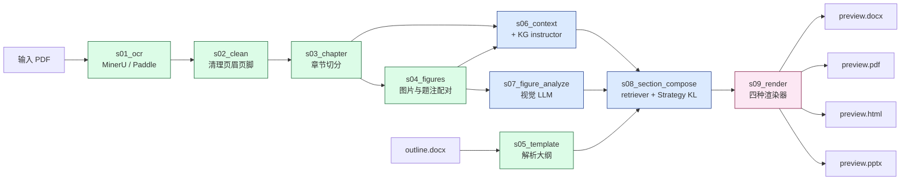
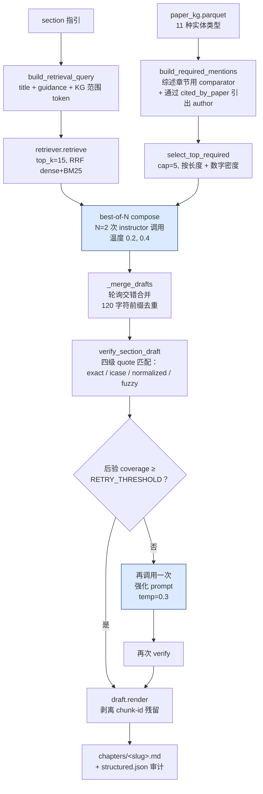

# 架构（Architecture）

## 流水线总览

`lazy-paper` 通过九个顺序阶段（stages）将一篇科研 PDF 转换为多格式分析文档。每个阶段：

- 从上一阶段的输出目录读取输入
- 在 `runs/<paper_id>/<stage>/` 下写入自己的输出目录
- 成功后写入一个 `done.yaml` 标记文件

各阶段是幂等的：若 `done.yaml` 存在，默认会跳过该阶段。`--force` 标志可以绕过这一检查；`--only <stage>` 标志只运行指定的某一个阶段，依赖之前阶段已存在的输出。

### 数据流一览



绿色 = 确定性阶段（无 LLM）。蓝色 = LLM 驱动阶段。粉色 = 渲染器。

### 磁盘布局

```
runs/<paper_id>/
  s01_ocr/             doc_*.md + imgs/*.jpg
  s02_clean/           doc_*.md（清洁后） + imgs/（复制）
  s03_chapter/         chapters/chapter_*.md + manifest.yaml
  s04_figures/         figures.yaml + mentions.yaml + imgs/（已升采样+合并）
  s05_template/        template.yaml
  s06_context/         context.yaml + paper_kg.parquet + paper_kg.rel.parquet
                       + paper_context.{prompt.md,response.json}
  s07_figure_analyze/  fig_notes.yaml + <fig_id>.{prompt.md,response.json}
  s08_section_compose/ chapters/*.md + retrieval.parquet + critic_flags.yaml
                       + findings.yaml + <slug>.{prompt.md,response.json,structured.json}
  s09_render/          preview.{docx,pdf,html,pptx} + done.yaml + llm_cache/
                       + mypaper_bundle/   （组装好的 markdown + 图片）
  meta.yaml
```

每次 LLM 调用都会将 prompt 与响应同时写入磁盘。使用 `--force --only <stage>` 单独重跑某一阶段，只会重新生成该阶段输出和下游差异 —— 这在迭代修改 prompt 时无需重跑 OCR，非常实用。

### Strategy KL compose（v1.8.1 起推荐路径）

当设置 `LAZY_PAPER_STRUCTURED=1 LAZY_PAPER_KG_PROMPT=paper_kg_v3.md LAZY_PAPER_BEST_OF_N=2` 时：



verifier 的四级匹配（`structured.py::_quote_in_chunk` + `stages/_common/normalize.py::normalize_ocr_latex`）是 v1.8.1 稳定性提升的关键：LaTeX 形态的 OCR（如 `$W _ { \mathrm { rec } }$`）会被归一化为 `w_{rec}`，即便源文本空白不同，LLM 原样引用的 quote 也能匹配上。完整溯因记录见 `docs/v1_8_validation_results.md`。

入口点：`cli.py::main` —— 解析参数、解析环境变量、对 `--paper-id` 做 slug 化（防御路径穿越攻击），按 `STAGE_ORDER` 迭代，每个阶段调用一次 `_run_one()`。

## 各阶段（Stages）

### s01_ocr

**目的**：将 PDF 转换为按页拆分的 Markdown（`doc_0.md`、`doc_1.md`……），每页内嵌指向 `imgs/` 中裁剪后图片的 `` 标签。

**输入**：原始 PDF 文件路径（来自 `--pdf`）。

**输出**：`doc_N.md` 文件 + `imgs/*.jpg` + `done.yaml`。

**关键代码**：`stages/s01_ocr/runner.py`

支持两种后端，由 `OCR_BACKEND` 环境变量选择：

- **PaddleOCR-VL**（`.env.example` 默认）：将每页 PDF 渲染成 PNG 并上传至 PaddleOCR AiStudio REST API（`https://paddleocr.aistudio-app.com/api/v2/ocr/jobs`）。每页通过 `pypdfium2` 渲染为 PNG，上传后轮询直到完成，再保存返回的 Markdown（其中 `` 标签将边界框编码到了文件名里）。
- **MinerU**（图表密集论文推荐）：`stages/s01_ocr/mineru.py` —— 用完整 PDF 调用 MinerU API，轮询至完成后下载结果归档。

OCR 完成后，`upscale_images()` 会用 `pypdfium2` 以 300 DPI 从原 PDF 中重新渲染每块裁剪图像区域，替换分辨率较低的 OCR 输出。OCR 像素空间到 PDF 点空间的坐标映射，按页从既有图像尺寸校准。

**认证**：`.env` 中的 `MINERU_TOKEN` 或 `PADDLEOCR_TOKEN`。

---

### s02_clean

**目的**：对 s01 输出的 `doc_*.md` 文件做 OCR 后处理校正。

**输入**：`s01_ocr/` 目录。

**输出**：清理后的 `doc_*.md` + 复制的 `imgs/` + `done.yaml`。

**关键代码**：`stages/s02_clean/runner.py`

三轮清理：

1. `strip_running_headers()` —— 识别在 3 页及以上原样出现的行（页眉/页脚），并将其删除。
2. `repair_chars()` —— 修复常见 OCR 字符伪影：`(cid:0)` → `−`、化学式下标修复（如 `TiO 2` → `TiO₂`）、阳离子上标修复等。
3. `flag_corrupted_column_flow()` —— 检测超过 60% token 为单字符的行（双栏重排伪影），用注释标记包裹。

`imgs/` 目录原样复制，使下游阶段可基于 clean 目录解析图片相对路径。

---

### s03_chapter

**目的**：使用 IMRaD 章节检测，将清理后的多页 Markdown 切分为按章节的文件。

**输入**：`s02_clean/` 目录。

**输出**：`chapters/chapter_NNN_<title>.md` + `manifest.yaml` + `done.yaml`。

**关键代码**：`stages/s03_chapter/runner.py`

`detect_science_anchor()` 将每行与一组规范小节名（`SECTION_ANCHORS`：abstract、introduction、experimental、results、discussion、conclusion、references 等）以及编号标题（`1. Introduction`、`2.1 Methods`……）做匹配。每个 anchor 启动一个新章节文件。第一个 anchor 之前的内容归入 `chapter_000_Preface.md`。

字符数低于 `min_chars`（默认 1）的章节会被丢弃。章节 manifest 会记录标题、文件名与字符数。

---

### s04_figures

**目的**：构建所有图片的结构化索引，包括其规范化 ID、题注、章节出现位置以及多面板合成图。

**输入**：`s02_clean/`（用于 bbox 校准的源文档）、`s03_chapter/chapters/`（章节文本用于检测引用提及）、PDF 文件。

**输出**：`figures.yaml`（图片 dict 列表，含 `fig_id`、`caption`、`image_abs_path`、`source_doc`） + `mentions.yaml`（映射 `chapter_filename -> [fig_id, …]`） + `done.yaml`。

**关键代码**：`stages/s04_figures/runner.py`

三个阶段：

1. **检测（Detection）**：扫描 `doc_*.md` 中的 `` 标签和 `Fig. N` / `Table N` 题注模式。每条图项记录规范化的 `fig_id`（统一为 `Fig. N` 形式）、题注文本、源文档以及图片相对路径（路径里编码了 OCR 边界框）。

2. **引用提及检测（Mention detection）**：扫描章节文件中的 `Fig. N` 和中文形态 `图N` 引用，构建 `mentions.yaml` 映射。

3. **多面板合并（Multi-panel merge）**：`_merge_figure_subpanels()` 将共享同一 `fig_id` 的条目分组，计算同一 PDF 页面上所有子面板的并集边界框，并用 `pypdfium2` 以 300 DPI 重新渲染一张合并后的图像。按页坐标比例由 `_calibrate_scale()` 基于既有图像尺寸校准。

---

### s05_template

**目的**：将用户提供的章节大纲 `.docx` 解析为带标题、指引文字与内容提示的结构化 section 列表。

**输入**：`--template` 路径（一个 `.docx` 文件）。

**输出**：`template.yaml`（section 节点列表） + `done.yaml`。

**关键代码**：`stages/s05_template/runner.py`

`parse_template()` 遍历 `python-docx` 的段落对象。编号段落（`1. Title`、`2.1 Subtitle`）和顶级列表项成为 section 节点。子级 bullet 成为 `children[]`，其文字被折叠进父节点的 `guidance` 字段。`_is_guidance_line()` 过滤掉冒充标题的指令文本。每个节点还携带由关键词匹配派生出的 `hints.needs_table` 与 `hints.needs_figure` 布尔标记。

---

### s06_context

**目的**：通过一次文本 LLM 调用，提取论文级上下文（标题、研究体系、关键词、缩写），随后为该论文构建 PaperDB 层。

**输入**：`s03_chapter/chapters/`（前 1–2 个章节）。

**输出**：`context.yaml` + `paper_kg.parquet` + `paper_context.prompt.md` + `paper_context.response.json` + `done.yaml`。

**关键代码**：`stages/s06_context/runner.py`、`stages/s06_context/kg_extract.py`

从 abstract 与 introduction 章节最多读取 20,000 个字符。以 `llm/prompts/paper_context.md` 为 prompt 调用 `LLM(role="text")`。LLM 返回 YAML，由 `safe_parse_yaml()` 进行防御性解析。解析后的 `context.yaml` 会被 s07、s08、s09 消费，将论文专属上下文注入所有下游 prompt。

#### v1.4：KG 子步骤

`context.yaml` 写入完成后，`kg_extract.build_paper_kg()` 使用 `instructor`（类型化的 Pydantic LLM 输出）从全部章节文本中抽取结构化知识图谱。抽取使用一个 **10 种类型的封闭 schema**：

| 类型 | 涵盖内容 |
|---|---|
| `material` | 主要研究材料 |
| `dopant` | 取代物 / 掺杂剂 |
| `parameter` | 实验或模拟参数 |
| `value` | 数值测量 |
| `unit` | 物理单位 |
| `figure` | 图引用 |
| `table` | 表引用 |
| `claim` | 关键论点 / 发现 |
| `method` | 合成或表征方法 |
| `comparator` | 比较基线 |

抽取器通过 `instructor.from_openai(LLM('text').client, mode=Mode.JSON)` 配合 `response_model=PaperKG` 进行一次 LLM 调用。成功后，实体 + 关系图会通过 `pyarrow` 序列化为 `paper_kg.parquet`。每个实体都携带 `source_span`，指回章节文本中精确的字符范围。

**软降级（Soft-degrade）**：若 `instructor` 经过两次重试仍无法解析为合法的 `PaperKG`，runner 会写入 `kg_extract.failed` 标记文件并返回 `None`。下游阶段检测到该标记后会降级到关键词行为 —— 流水线永远不会中断。

类似地，混合检索索引（`retrieval.parquet`）由章节 chunk 构建；若 embedding API 不可用，runner 会写入 `retrieval.failed`，s08 改用关键词节选。

---

### s07_figure_analyze

**目的**：用视觉 LLM 分析每张图，为每张图产出结构化观察。

**输入**：`s04_figures/figures.yaml` + `s04_figures/mentions.yaml` + `s03_chapter/chapters/`（用于文本节选） + `s06_context/context.yaml`。

**输出**：`fig_notes.yaml`（结构化图分析 dict 列表） + 每张图的 `<fig_id>.prompt.md` + `<fig_id>.response.json` + `done.yaml`。

**关键代码**：`stages/s07_figure_analyze/runner.py`

对 `figures.yaml` 中每个规范化 `fig_id`：

1. 收集该 figure ID 的所有子面板图片路径。
2. 从被引用到该 figure 的章节中节选最多 6,000 字符文本（`_excerpts()`）。
3. 用图片 + `llm/prompts/figure_analyze.md` 模板调用 `LLM(role="vision")`。
4. 写出 `<fig_id>.prompt.md` 和 `<fig_id>.response.json` 用于审计。
5. 将 YAML 响应解析为结构化 note dict，包含 `fig_id`、`caption`、`deep_observation`、`image_paths`。

输出语言（中文 / 英文）由 `--lang` 通过 `LANG_INSTRUCTIONS` 控制。

---

### s08_section_compose

**目的**：按模板大纲，以目标语言写出每个输出 section 的正文 —— 输入由检索器（retriever）提供证据，可选叠加 pydantic-ai 工具调用 agent。

**输入**：`s05_template/template.yaml` + `s03_chapter/chapters/` + `s06_context/context.yaml` + `s06_context/paper_kg.parquet` + `s07_figure_analyze/fig_notes.yaml` + `s04_figures/figures.yaml` + `retrieval.parquet`。

**输出**：`chapters/<slug>.md`（每个模板 section 一个） + `retrieval.parquet` + `critic_flags.yaml` + `findings.yaml` + 每个 section 的 `<slug>.prompt.md` + `<slug>.response.json` + `done.yaml`。

**关键代码**：`stages/s08_section_compose/runner.py`、`stages/s08_section_compose/structured.py`、`stages/s08_section_compose/reviewer.py`、`stages/s08_section_compose/agent.py`

#### Strategy KL —— structured compose + best-of-N + author KG（v1.8.1 起为默认推荐）

当 `LAZY_PAPER_STRUCTURED=1` 且 retriever 与 KG 均可用时，runner 使用 `stages/s08_section_compose/structured.py` 中基于 instructor 的结构化撰写流水线，取代 `_legacy_compose` 路径。这是 v1.8.1+ 推荐的路径，也是唯一经过基准复现质量验证的路径。

每个 section 流程：

1. **检索（Retrieval）**：`retriever.retrieve(query, top_k=15)` 返回 RRF 融合后的 chunk。
2. **必含提及（Required mentions）**：`build_required_mentions` 选定 KG 实体（综述 section 使用全部 comparator，非综述使用受控实体），并把每个实体解析到一条覆盖它的 retrieved chunk 索引 + 通过 `cited_by_paper` 关系链接到可选的 author 文本。`select_top_required(cap=5)` 按长度 + 数字密度排序。
3. **Best-of-N compose**（环境变量 `LAZY_PAPER_BEST_OF_N`，默认 1，推荐 2）：在温度 0.2、0.4、0.6…… 下进行 N 次独立的 `instructor + SectionDraft` 调用。Pydantic 校验器会拒绝 `cited_chunk_ids` 超出 retrieved 集合的草稿。结果草稿通过轮询交错 + 120 字符前缀去重做并集合并。
4. **Verify**：`verify_section_draft(draft, chunks_by_id, ratio_threshold)` 校验每条 claim 的 `cited_quote`。匹配器依次尝试 (a) 精确子串；(b) 大小写不敏感子串；(c) **归一化子串**（`_normalize_for_match` 剥离 LaTeX 命令并折叠 OCR 数字间空白）；(d) 在归一化文本上的模糊最长公共子串。若所引 chunk 未匹配上，verifier 会回退扫描所有 retrieved chunk —— 当 quote 在非引 chunk 中被找到时，claim 被接受，`cited_chunk_ids` 被纠正（chunk-ID 容错）。阈值可通过环境变量 `LAZY_PAPER_VERIFIER_THRESHOLD` 覆写（默认 0.85）。
5. **空时重试（Retry-when-empty）**：对**经过 verify 的草稿**计算 `missing_required`。若 `post_cov ≤ LAZY_PAPER_RETRY_THRESHOLD`（默认 0.5），再发一次 `_single_compose`，使用强化系统 prompt 显式点名缺失实体；重新 verify；如覆盖度提升则替换。每个 section 最多额外调用一次。
6. **渲染（Render）**：`draft.render(mode="REMOVE")` 将 SectionDraft 平铺为正文。残留的 `(chunk N)` / `[N, M]` 模式会被剥离。

KG 抽取使用 `paper_kg_v3.md`（通过 `LAZY_PAPER_KG_PROMPT=paper_kg_v3.md` 选择），它在 10 种实体基础上新增第 11 种 `author`，并通过 `cited_by_paper` 关系链接到每个 `comparator`。正是这一步让撰写 prompt 能输出 *"Jiang et al. reported W_rec=2.94 J/cm³"*，而不是裸的化学式。

证明此路径稳定性的验证见 `docs/v1_8_validation_results.md`（meng2024 ch01 平均 15.0/17，下限 12，范围 12–17 —— vs v1.7 KL 下限 1）。

#### 默认按 section 算法（v1.4 回退路径）

对 `template.yaml` 中每个 section 节点：

1. **证据检索**：从 `retrieval.parquet` 加载 `Retriever` 并调用 `retriever.retrieve(guidance, top_k=8)`。默认的 `_legacy_compose` 路径不传 `entity_boost`；只有可选的 agent 路径才会传入实体 ID 做加权。RRF 融合后的 chunk 排序综合了 dense 余弦相似度 + BM25 稀疏。当 `retrieval.failed` 或 `kg_extract.failed` 标记存在时回退到关键词节选。

2. **跨章节上下文（v1.4.1）**：将最近 8 个已撰 section 的首句滚动摘要塞入 compose prompt 的 `{prior_findings}` 槽位，并加上 "do not restate verbatim — refer back, build on, or contrast" 指令。可消除跨章节逐字重复（如 v1.4.0 时 meng2024 出现的化学式重复问题）。

3. **撰写（Composition）**：用 `llm/prompts/section_compose.md` 调用 `LLM(role="text")`，注入论文上下文、section 元数据、检索到的证据 chunk、figure note 与 `{prior_findings}`。

4. **语言守卫（v1.4.1）**：当设置 `--lang zh` 时，composer 后校验草稿的中文字符占比。若占比 < 30% 且长度 > 100 字符（LLM 默认输出了原文英文），用硬性的 "OUTPUT MUST BE WRITTEN IN CHINESE" 系统 prompt 增量重试一次。

5. **正则 critic**：`reviewer.regex_check(draft, source_docs, kg, fig_yaml)` 扫描草稿中：
   - 源文档中没有的数值（通过 `_units.normalize()` 做单位归一化）
   - `figures.yaml` 中不存在的 `Fig. N` / `Table N` 引用
   - KG 中不存在的化学式或符号绑定

   任何生成的 `Flag` 对象都会追加到 `critic_flags.yaml`。

6. **LLM critic**：若 `reviewer.regex_check()` 产生了 flags，则调用 `reviewer.llm_review(draft, flags, evidence)`。reviewer 用 `instructor`，`response_model=CritiqueRevision`，该模型含 `revised_draft`、`quote_fidelity`、`grounding`、`synthesis_depth`（均为 1–4 Likert 评分）以及 `notes`。修订后的草稿替换原稿，再走一次正则检查；如仍有 flag，则软通过并记录 warning。

7. **Findings 雏形**：`findings.append_verified_claims(section.title, claims)` 将审阅后草稿中已验证的 claim 追加到 `findings.yaml`（v1.4 仅写入；v1.5 由未来的跨章一致性 agent 消费）。

8. 将章节 Markdown 写入 `chapters/<slug>.md`。若 `composed` 为空（两次 compose 均失败），改写一个占位标记，避免下游阶段无声地输出仅有标题的章节。

#### 可选 pydantic-ai agent 路径（实验性，env-gated）

设置 `LAZY_PAPER_AGENT=1` 可将上文第 2 步替换为 `pydantic-ai` 工具调用 agent 循环。该 agent（`stages/s08_section_compose/agent.py`）获得四个工具：

| 工具 | 签名 | 用途 |
|---|---|---|
| `query_kg` | `(entity_type, filter?) → list[dict]` | 按类型查 KG；类型来自 10 种封闭 schema。 |
| `retrieve` | `(query, top_k=8, entity_boost?) → list[dict]` | dense+BM25 混合检索；top_k 被夹紧到 12。 |
| `check_source` | `(claim, expected_value?) → dict` | 子串 + 单位归一化查找；返回 `{found, span, evidence}`。 |
| `emit_section` | `(draft) → str` | 终结调用；校验至少含 1 个 `[span:...]` 引用标记，结束工具循环。 |

agent 最多运行 `max_iters=8` 次工具循环，然后强制 `emit_section`。agent 循环中的任何异常都会让 runner 回退到该 section 的 legacy compose，并打印 `[degraded] agent fallback for <section.title>`。

**为何 env-gated**：线上跑发现 agent 偶尔会返回元注释（"I will now write…"）而非 section 正文。该开关让你可以在已知良好环境中按需启用，同时默认路径保持稳定。

---

### s09_render

**目的**：从撰写后的章节 + figure note 构建 `Document` 模型，然后渲染到所有请求的输出格式。

**输入**：`s08_section_compose/chapters/` + `s07_figure_analyze/fig_notes.yaml` + `s06_context/context.yaml`。

**输出**：`preview.{docx,pdf,html,pptx}` + `mypaper_bundle/` + `done.yaml`。

**关键代码**：`stages/s09_render/runner.py`

各组件细节见下文小节。

#### DocumentBuilder

`stages/s09_render/builder.py::DocumentBuilder`

纯变换 —— 无 IO。接收 `chapters_md`（文件名 → Markdown 文本的 dict）与 `fig_notes`（figure dict 列表）。返回一个 frozen `Document`。

- 章节按字典序排序（对应 `s08_section_compose` 命名）。
- 每个章节的 Markdown 按双换行切分成 `Paragraph` 块。
- 图片作为 `FigureBlock` 对象嵌入到**首个**引用该图的章节中（按 `fig_id` 字面或中文形态 `图N`）。整篇文档里每张图最多嵌入一次。

#### Renderer ABC

`stages/s09_render/renderers/base.py::Renderer`

抽象基类。每个 renderer 必须声明 `extension: ClassVar[str]`，并实现 `render(doc: Document, out_path: Path) -> None`。renderer 不得修改输入的 `Document`。

renderer 通过在 `runner.py` 中导入自身模块来向 `RENDERERS` 字典注册自己。注册表将扩展名字符串映射到 renderer 类。

#### 四个 renderer

| 文件 | 类 | 主要依赖 |
|------|-------|-----------------|
| `renderers/docx.py` | `DocxRenderer` | `python-docx` |
| `renderers/html.py` | `HtmlRenderer` | `jinja2`、base64 嵌图 |
| `renderers/pdf.py`  | `PdfRenderer`  | `weasyprint`、复用 HTML 模板 |
| `renderers/pptx.py` | `PptxRenderer` | `python-pptx`、`SlidePlanner`、`PptxSummarizer` |

DOCX renderer 对拉丁文使用 Times New Roman，对中文字符使用宋体（Song Ti），并附带条件性的东亚字体设置。HTML renderer 将所有图片以 base64 data URL 内嵌，产出单文件自包含 HTML。PDF renderer 通过 WeasyPrint 渲染同一 HTML 模板。

#### SlidePlanner

`stages/s09_render/slide_planner.py::SlidePlanner`

确定性、无 IO。将 `Document` + 可选 LLM 摘要 + 大纲转换为 `SlideDeck`。Slide 类型：`title`、`outline`、`section_divider`、`bullets`、`figure`、`combined`、`closing`、`closing_rich`。提供 LLM 大纲时，会将各章节归入 4–5 个具名小节；纯 bullet 章节会被吸收到对应的 section_divider 幻灯片中。

#### PptxSummarizer

`stages/s09_render/pptx_summarizer.py::PptxSummarizer`

LLM 驱动的摘要器，带双轨缓存。请求 PPTX 时两遍处理：

1. `summarize_outline()`：用 `llm/prompts/pptx_outline.md` 把章节归入 4–5 个具名小节。prompt 中含每章元信息（has_figures、n_paragraphs）。
2. `summarize()`：用 `llm/prompts/pptx_summarize.md` 按章节生成 bullet，结合跨章节上下文（system、keywords、section_name、prior_bullet、next_heading）。
3. `summarize_paper()`：用 `llm/prompts/pptx_paper_summary.md` 生成 closing 幻灯的论文 brief（5–7 条 bullet + 一句总结）。

---

## PaperDB 层（v1.4+）

PaperDB 层为每篇论文新增了一个跨 s06、s08 持久的结构化知识库。由 s06 写入、s08 消费的两份 Parquet 文件组成。

### paper_kg.parquet

由 `stages/s06_context/kg_extract.py` 写入。包含 `instructor` 在 10 种封闭 schema 下从论文中抽取的全部实体与关系。

**Schema**：

```
entities table:
  id          string    — 每个实体稳定的 UUID
  type        string    — 10 种封闭类型之一
  text        string    — 在论文中出现的表面形式
  source_span struct    — {chapter: str, start: int, end: int}
  attributes  map       — 按类型而异（例如 `value` 实体的 value + unit）

relations table:
  subject_id  string    — 实体 UUID
  predicate   string    — 如 "has_value", "uses_method", "compared_to"
  object_id   string    — 实体 UUID
  source_span struct    — 在论文文本中的位置
```

**生命周期**：`paper_kg.parquet` 每篇论文写入一次，在 s06 上即便 `--force` 也会保留（KG 抽取代价高；要强制重抽请显式删除该文件）。当 `kg_extract.failed` 标记存在时，s08 降级到关键词回退。

**交叉引用**：`stages/s06_context/kg_extract.py`、`llm/retriever.py::Retriever.query_kg()`

### retrieval.parquet

由 `llm/retriever.py::Retriever.build_index()` 在 s08 初始化期间写入。包含所有章节 chunk 的稠密向量 embedding 与 BM25 索引数据。

**Schema**：

```
chunks table:
  chunk_id    string    — UUID
  chapter     string    — 源章节文件名
  text        string    — chunk 文本（SentenceSplitter，400 字符，overlap 80）
  start_char  int       — 章节内字符偏移
  end_char    int       — 章节内字符偏移
  embedding   list[f32] — 稠密向量（text-embedding-3-small，1536 维）
  bm25_tokens list[str] — BM25 预分词
```

BM25 词频与倒排索引与 chunks 表一同序列化。在 500 chunk 上检索约 ~12.5 ms（纯 numpy 稀疏运算，经 `bm25s`）。

**检索（Retrieval）**：`Retriever.retrieve(query, top_k=8, entity_boost=[])` 并行运行稠密余弦相似度与 BM25，通过 Reciprocal Rank Fusion (RRF) 融合，然后施加实体跨度加权：`[start_char, end_char]` 区间与 `entity_boost` 中任一实体 span 重叠的 chunk 会被提升排名。

**交叉引用**：`llm/retriever.py`、`stages/s08_section_compose/runner.py`

---

## 引文处理（Citation processing，v1.4+）

### 流式处理器（vendored）

`llm/citation/stream_processor.py` 来自 [Onyx](https://github.com/onyx-dot-app/onyx)（`backend/onyx/chat/citation_processor.py`，MIT 协议）。原始 MIT header 与作者署名被逐字保留。三处 Onyx 内部 import（`SearchDoc`、`CitationInfo`、`STOP_STREAM_PAT`）被替换为本地 Pydantic 模型；所有正则状态机逻辑与渲染模式保持原样。

**许可证**：源仓库、commit SHA 与 MIT 完整文本见 `THIRD_PARTY_NOTICES.md`。

### 三种渲染模式

| 模式 | 行为 | 适用场景 |
|---|---|---|
| `REMOVE` | 去除所有 `[span:doc_X:Y-Z]` 标记 —— 最终输出干净正文。 | 终端用户**默认**模式。 |
| `KEEP` | 保留标记为字面文本。 | 调试检索归因。 |
| `HYPERLINK` | 在 DOCX/HTML 输出中将标记转为指向源 chunk 的超链接。 | QA 审查、citation 审计。 |

模式通过 `llm/citation/__init__.py::CitationAdapter` 选择，该适配器把 lazy-paper 的 `Source`/`Citation` Pydantic 模型桥接到 Onyx 的 `SearchDoc`/`CitationInfo` 接口。

### CLI 标志

传入 `--debug-citations` 可切换到 `KEEP` 模式，在 DOCX 和 HTML 输出中暴露 `[span:...]` 标记。默认是 `REMOVE`。该标志对 PPTX 无效（speaker notes 无论如何都会带上标记）。

**交叉引用**：`llm/citation/__init__.py`、`llm/citation/stream_processor.py`、`stages/s09_render/renderers/docx.py`

---

## 跨切面关注点（Cross-cutting concerns）

### 可恢复执行（Resumability）

每个阶段成功后通过 `stages/_common/done.py::mark_done()` 写入：

```python
dump_yaml(stage_path / "done.yaml", {"finished_at": time.time(), **extra})
```

`is_done(path)` 在 `done.yaml` 存在时返回 `True`。除非设置 `--force`，CLI 会跳过 `is_done` 为真的阶段。对于 s09_render，`done.yaml` 还记录 `formats` dict（扩展名 → 文件路径或 error dict）和 `partial` 标志。

### LLM token 预算

所有 LLM 调用点都经 `llm.client.max_tokens(default)`，被 `LLM_MAX_TOKENS_CEILING` 环境变量夹紧（默认 40000）。按阶段默认值：

| 阶段 | 调用 | 默认 `max_tokens` |
|---|---|---|
| s06_context | paper context | 4000 |
| s07_figure_analyze | per figure（vision） | 4000 |
| s08_section_compose | per chapter（text） | 12000 |
| s09_render / PptxSummarizer | `summarize_outline` | 16000 |
| s09_render / PptxSummarizer | `summarize`（per chapter） | 8000 |
| s09_render / PptxSummarizer | `summarize_paper`（closing） | 8000 |

DeepSeek-Reasoner 在输出 JSON 内容前会消耗思维链（chain-of-thought）token；预算特意设置得宽裕，避免 JSON 负载被截断为空串。空内容响应现在会抛出有意义的错误，让重试循环干净地短路。

### LLM 缓存

`PptxSummarizer` 在 `s09_render/llm_cache/` 下使用双轨缓存：

- **复用轨（Reuse track）**：`<slug>.json`，内容为 `{"input_hash": ..., "payload": ...}`。若存储的 `input_hash` 与当前输入匹配（由 SHA-256 对 prompt 版本 + lang + 章节内容 + 跨章节上下文求得），则跳过 LLM 调用。
- **审计轨（Audit track）**：无论 LLM 是否被调用，每次都在缓存条目旁写出 `<slug>.prompt.md` 与 `<slug>.response.json`。Prompt 和原始响应始终可供检视。

缓存失效由 `_PROMPT_VERSION` 常量控制（`_CHAPTER_PROMPT_VERSION`、`_OUTLINE_PROMPT_VERSION`、`_PAPER_PROMPT_VERSION`）。修改任意常量都会改变 SHA-256 输入，从而在下次运行时强制 miss。

其他 LLM 阶段（s06、s07、s08）不使用 hash 缓存 —— 它们每次跑都会写 prompt/response 文件用于审计，但每次未跳过的调用都会重新调 LLM。

### 软失败（Soft failure）

在 s09_render 中，每个 renderer 都被包在 `try/except Exception` 内。失败时，错误会记录在 `done.yaml` 的 `formats.<ext>.error` 中，`partial` 置为 `True`，并把 warning 打到 stderr。其它 renderer 继续。

如果所有请求的 renderer 都失败，则抛出 `RuntimeError`（硬失败）。否则本次运行以部分输出完成。

`--retry-failed`（与 `--only s09_render` 配合使用）会读取上次部分运行的 `done.yaml`，只重跑 `error` 键下列出的格式。

### macOS WeasyPrint

`cli.py::_augment_dyld_for_macos_brew()` 在 import 时（在任何 stage import 之前）运行。它会把 `/opt/homebrew/lib` 与 `/usr/local/lib` 前置到 `DYLD_FALLBACK_LIBRARY_PATH`，确保 WeasyPrint 能找到通过 Homebrew 安装的 Pango、Cairo、gdk-pixbuf。在 Linux（Docker）与 Windows 上不操作。测试套件在 `conftest.py` 中有并行的 shim。

## 数据模型

```
Document (frozen dataclass)
  paper_title: str
  lang: str                      # "zh" | "en"
  chapters: tuple[Chapter, ...]

Chapter (frozen dataclass)
  heading: str
  level: int                     # 1 = H1
  blocks: tuple[Block, ...]      # Block = Paragraph | FigureBlock

Paragraph (frozen dataclass)
  text: str

FigureBlock (frozen dataclass)
  fig_id: str                    # 规范化 "Fig. 5"
  label: str                     # 本地化 "Fig. 5" 或 "图 5"
  image_paths: tuple[Path, ...]  # 每个 panel 一条路径
  caption: str
  deep_observation: str
```

所有字段构造后不可变。renderer 通过 `isinstance(block, FigureBlock)` 与 `isinstance(block, Paragraph)` 做分派。

```
SlideDeck (frozen dataclass)
  slides: tuple[Slide, ...]
  lang: str

Slide (frozen dataclass)
  kind: str      # title | outline | section_divider | bullets | figure | combined | closing | closing_rich
  title: str
  bullets: tuple[str, ...]
  image_paths: tuple[Path, ...]
  caption: str
  deep_observation: str
  observations: tuple[str, ...]
  notes: str     # speaker notes
```

## 增加一种新的输出格式

1. 新建 `stages/s09_render/renderers/<fmt>.py`。继承 `Renderer`，设置 `extension = "<fmt>"`，实现 `render(doc, out_path)`。
2. 在该文件末尾注册：`RENDERERS["<fmt>"] = MyRenderer`。
3. 在 `stages/s09_render/runner.py` 中加上 `import stages.s09_render.renderers.<fmt>  # noqa: F401`。
4. 在 `stages/s09_render/tests/` 添加一个冒烟测试，实例化该 renderer 并用最小 `Document` 调用 `render()`。

renderer 收到的是 frozen `Document`，不得修改任何字段。如果格式需要预处理（如 PPTX 用 `SlidePlanner` 做的），请在 renderer 构造函数或 `render()` 方法中完成。

## 增加一个新的 LLM 阶段

1. 按 s06 或 s07 的模板新建 `stages/s<NN>_<name>/runner.py`：
   - `PROMPT_PATH = Path(__file__).resolve().parents[2] / "llm" / "prompts" / "<name>.md"`
   - `_PROMPT_VERSION = "v1"` 常量用于缓存版本化
   - `run(*, ..., out_dir: Path) -> dict` 函数
   - 返回前调用 `mark_done(out_dir, {...})`
2. 把 prompt 模板放到 `llm/prompts/<name>.md`。用 `SYSTEM:` / `USER:` section 标记以及 `{placeholder}` 做运行时替换。
3. 对需要缓存（昂贵或重复）的 LLM 调用，仿照 `PptxSummarizer` 实现 `_make_hash(version, lang, *content_bytes)` + `_try_cache(slug, hash)` + `_write_cache(slug, hash, payload, prompt, response)`。
4. 每次 LLM 调用都在旁边写 prompt 与响应文件（`<slug>.prompt.md`、`<slug>.response.json`）用于审计。
5. 在 `cli.py` 注册该阶段：加入 `STAGE_ORDER`，在 `_run_one()` 中添加 `elif name == "s<NN>_..."` 分支，并在文件顶部 import runner 模块。
6. 新增一个 `tests/` 目录，至少包含一个单元测试，用 fixture 数据和 mock LLM 跑通 runner。
